# Rideshare Forecast


This project uses time series models to forecast rideshare in the East Village.

```r
# Install required libraries if necessary.
library("forecast")
library("lubridate")
library("gridExtra")
library("tidyverse")
library("caret")
library("tscount")
library("astsa")
```


```r
# Input data
uber_6h <- read_csv('../../data/uber_pickups_lower_manhattan_wide_6h.csv') # Point this to the directory and file

uber_train <- uber_6h %>% filter(Pickup_date < ymd_hms("2015-06-01 00:00:00")) # This gives us a training set for all 8 locations
uber_test <- uber_6h %>% filter(Pickup_date >= ymd_hms("2015-06-01 00:00:00"))
uber_train <- uber_train %>% mutate(season=weekdays(Pickup_date, abbreviate=TRUE))
uber_test <- uber_test %>% mutate(season=weekdays(Pickup_date, abbreviate=TRUE))
# nrow(uber_6h) # if we want to check number of observations
# names(uber_6h) # use this command if you want to see the available time series
train_freq <- ts(uber_train$East_Village, frequency=28)
test_freq <- ts(uber_test$East_Village, frequency=28)
```


```r
head(uber_test)
```

```
## # A tibble: 6 x 10
##   Pickup_date         East_Village Gramercy GVillage_N GVillage_S
##   <dttm>                     <dbl>    <dbl>      <dbl>      <dbl>
## 1 2015-06-01 00:00:00          217       70         58         75
## 2 2015-06-01 06:00:00          665      500        421        208
## 3 2015-06-01 12:00:00          436      375        415        259
## 4 2015-06-01 18:00:00          767      512        642        501
## 5 2015-06-02 00:00:00          220       99         73         96
## 6 2015-06-02 06:00:00          544      486        390        202
## # … with 5 more variables: Little_Italy <dbl>, LES <dbl>, SoHo <dbl>,
## #   Union_Sq <dbl>, season <chr>
```


## Train-test split

We will use the first five months as training data and predict Uber pickups for June 2015 in the East Village. The date is in positx format which can be parsed using the lubridate package. 

Statistical forecasting techniques are used on the East Village training data, and will be evaluated on East Village test data. 


```r
# This block selects only east village data and splits it into train/test sets
full_ts <- msts(uber_6h$East_Village,
                    start=decimal_date(ymd_hms("2015-01-01 00:00:00")),
                    seasonal.periods=c(4, 1461))

train_ts <- msts(uber_train$East_Village,
                    start=decimal_date(ymd_hms("2015-01-01 00:00:00")),
                    seasonal.periods=c(4, 1461))

test_ts <- msts(uber_test$East_Village,
                    start=decimal_date(ymd_hms("2015-06-01 00:00:00")),
                    seasonal.periods=c(4, 1461))


#train_ts <- window(full_ts, start=decimal_date(ymd_hms("2015-01-01 00:00:00"))) # Train with obsercations up until june

#test_ts <- window(full_ts, start=decimal_date(ymd_hms("2015-06-01 00:00:00"))) # Test out predictions with June data
y_test <- as.numeric(test_ts)
test_size <- length(y_test)
```


```r
# Show full data set
p1 <- full_ts %>% autoplot(series="All Trips") + 
  ggtitle("Full Dataset") +
  guides(colour=guide_legend("Data"))+
  scale_color_manual(values=c("black"))

# Show training dataset
p2 <- autoplot(train_ts, series="Training")+
  autolayer(test_ts,  series="Validation")+
  guides(colour=guide_legend("Split"))+
  scale_color_manual(values=c("black", "grey"))+
  ggtitle("Train/Test Split")

grid.arrange(p1, p2, nrow=2, ncol=1)
```

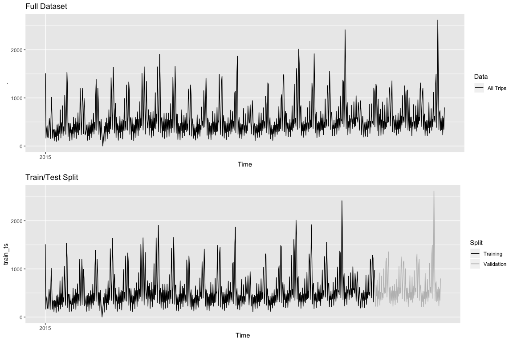<!-- -->

To look at any of the other 7 pickup locations, call `lil_italy <- uber_train %>% select(Little_Italy)` for example.


```r
# Show subset of data to look for patterns

jan_to_march <- train_ts %>% window(end=decimal_date(ymd_hms("2015-03-01 00:00:00")))

jan_to_march %>% autoplot()+
  ggtitle("2 Months of Uber Pickup Data")
```

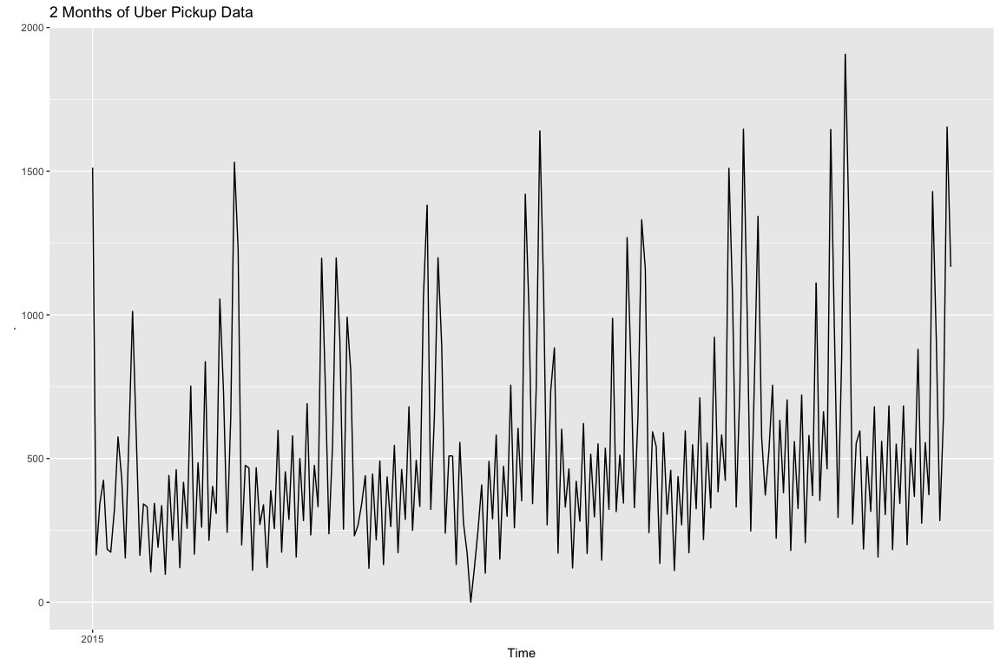<!-- -->


By aggregating to 6-hour windows we model the demand per "shift" in a day.

- 00:00 - 05:59 - Graveyard Shift
- 06:00 - 11:59 - Morning Shift
- 12:00 - 17:59 - Afternoon Shift
- 18:00 - 23:59 - Evening Shift

## Moving Average Filter


```r
jan <- geom_vline(xintercept = decimal_date(ymd_hms("2015-01-01 00:00:00")), linetype="dashed", color = "blue", size=0.5)
feb <- geom_vline(xintercept = decimal_date(ymd_hms("2015-02-01 00:00:00")), linetype="dashed", color = "blue", size=0.5)
mar <- geom_vline(xintercept = decimal_date(ymd_hms("2015-03-01 00:00:00")), linetype="dashed", color = "blue", size=0.5)
apr <- geom_vline(xintercept = decimal_date(ymd_hms("2015-04-01 00:00:00")), linetype="dashed", color = "blue", size=0.5)
may <- geom_vline(xintercept = decimal_date(ymd_hms("2015-05-01 00:00:00")), linetype="dashed", color = "blue", size=0.5)
jun <- geom_vline(xintercept = decimal_date(ymd_hms("2015-06-01 00:00:00")), linetype="dashed", color = "blue", size=0.5)

train_ts %>% autoplot(series="Original Data")+
  autolayer(ma(train_ts, 4), series="Moving Average")+
  jan + feb + mar + apr + may + jun + # adding month lines
  guides(colour=guide_legend("Split"))+
  scale_color_manual(values=c("black", "grey"))+
  ggtitle("Moving Average of Training Data")
```

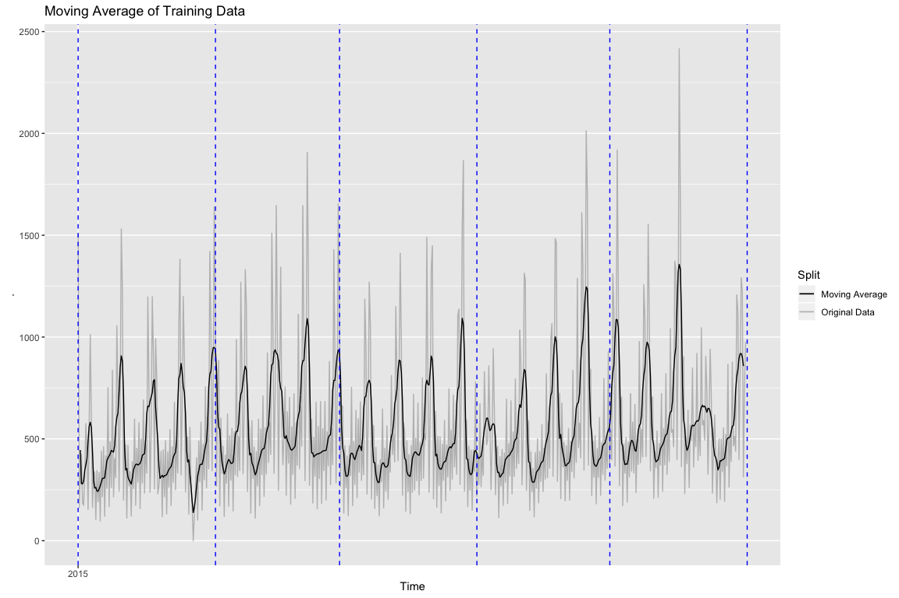<!-- -->

This helps with telling the seasonality of the data. It looks like there is a spike in demand at the beginning of each month. In addition there are about three spikes during each month. This probably corresponds to __weekly spikes in demand__. 

## Analyzing the trend


```r
lm(train_ts ~ time(train_ts)) %>% fitted() -> yhat.lm
autoplot(train_ts) + 
  geom_line(mapping=aes(x=time(train_ts), y=yhat.lm), color="red")+
  ggtitle("Linear Trend Fit")+
  xlab("Time")+
  ylab("Pickups")
```

<!-- -->


There is a slight linear trend. Let's see what the ACF and PACF plots look like.


```r
p1 <- ggAcf(train_ts) + ggtitle("ACF of Uber Pickups")
p2 <- ggPacf(train_ts) + ggtitle("PACF of Uber Pickups")
grid.arrange(p1, p2, nrow=2, ncol=1)
```

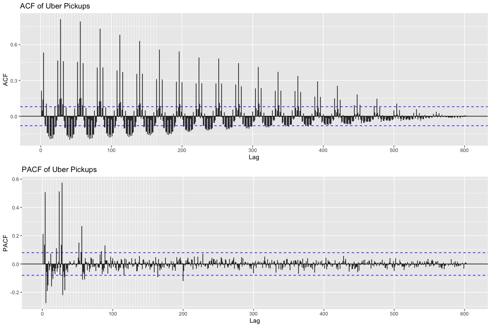<!-- -->


Not very informative although it initially hints toward an AR(p) model after a difference. 

Before checking the lag plot, the trend should be removed via differencing.

## Differencing 


```r
# code for differencing the training data
train_diff <- diff(train_ts)
lm(train_diff ~ time(train_diff)) %>% fitted() -> yhat.lm

train_diff %>% autoplot() + 
  geom_line(mapping=aes(x=time(train_diff), y=yhat.lm), color="red") + 
  ggtitle("Differenced Pickup Data") + 
  ylab("Change in Pickups")
```

<!-- -->


```r
# Comparison of time series plots

lm(train_ts ~ time(train_ts)) %>% fitted() -> yhat.lm1
p1 <- autoplot(train_ts) + 
  geom_line(mapping=aes(x=time(train_ts), y=yhat.lm1), color="red")+
  ggtitle("Original Data with Linear Fit")+
  xlab("Time")+
  ylab("Pickups")

# code for differencing the training data
train_diff <- diff(train_ts)
lm(train_diff ~ time(train_diff)) %>% fitted() -> yhat.lm2

p2 <- train_diff %>% autoplot() + 
  geom_line(mapping=aes(x=time(train_diff), y=yhat.lm2), color="red") + 
  ggtitle("Differenced Data with Linear Fit") + 
  ylab("Change in Pickups")

grid.arrange(p1, p2, nrow=1, ncol=2)
```

<!-- -->


## Zoom in


```r
diffwin <- train_diff %>% window(end=decimal_date(ymd_hms("2015-03-01 00:00:00"))) 
diffwin %>% autoplot() + ggtitle("2 Months of Differenced Pickups")
```

<!-- -->


```r
diffwin %>% autoplot(series="Original Data")+
  autolayer(ma(diffwin, 28), series="Moving Average")+
  jan + feb + mar +
  guides(colour=guide_legend("Split"))+
  scale_color_manual(values=c("black", "grey"))+
  ggtitle("Moving Average of Training Data (Jan and Feb)")
```

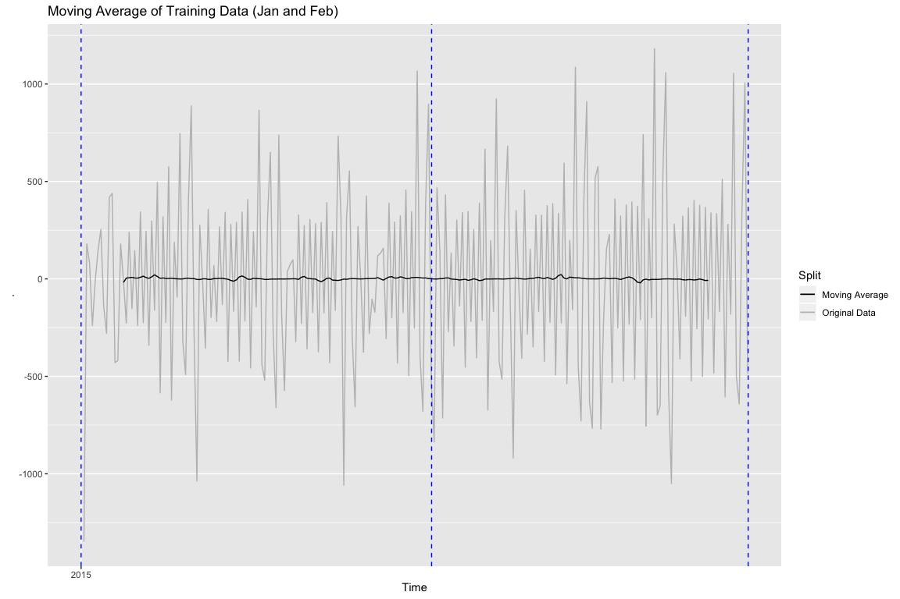<!-- -->


```r
p1 <- train_diff  %>% ggAcf() + ggtitle("ACF of Differenced Uber Pickups")
p2 <- train_diff %>% ggPacf() + ggtitle("PACF of Differenced Uber Pickups")
grid.arrange(p1, p2, nrow=1, ncol=2)
```

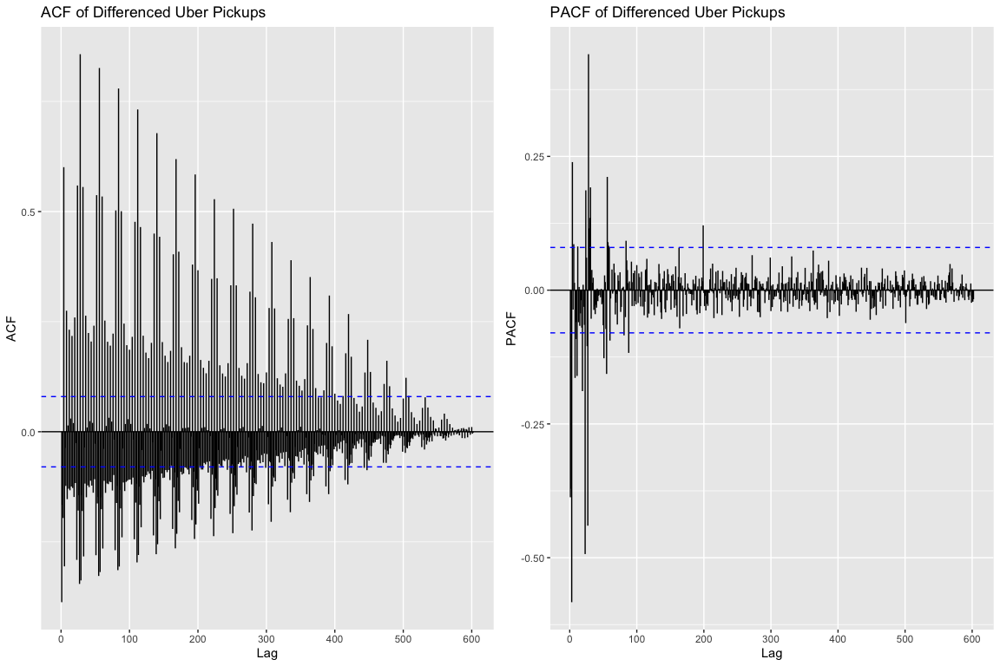<!-- -->


```r
# ACF of differenced data
train_diff %>% Acf(plot=FALSE, lag.max=30)
```

```
## 
## Autocorrelations of series '.', by lag
## 
##      0      1      2      3      4      5      6      7      8      9 
##  1.000 -0.387 -0.166 -0.196  0.601 -0.306 -0.037 -0.123  0.275 -0.153 
##     10     11     12     13     14     15     16     17     18     19 
##  0.014 -0.129  0.232 -0.133  0.030 -0.124  0.218 -0.128  0.020 -0.148 
##     20     21     22     23     24     25     26     27     28     29 
##  0.259 -0.117 -0.026 -0.291  0.559 -0.179 -0.144 -0.346  0.857 -0.338 
##     30 
## -0.144
```


```r
# PACF of differenced data
train_diff %>% Pacf(plot=FALSE, lag.max=30)
```

```
## 
## Partial autocorrelations of series '.', by lag
## 
##      1      2      3      4      5      6      7      8      9     10 
## -0.387 -0.371 -0.583  0.239 -0.036  0.086  0.014 -0.164 -0.060 -0.091 
##     11     12     13     14     15     16     17     18     19     20 
## -0.160  0.082 -0.060  0.006 -0.067 -0.043 -0.019 -0.070 -0.189  0.010 
##     21     22     23     24     25     26     27     28     29     30 
## -0.031 -0.065 -0.493  0.187  0.061 -0.105 -0.440  0.441  0.115  0.135
```


There is clear seasonality and a sharp cutoff after lag 26-ish. Each lag is 1 shift, so 24 shifts would be 6 days of pickups, 26 shifts would be 6.5 days of pickups (evening shift of the 6th day). 

In the ACF plot there is a spike at lag 4, and another lower spike at lag 8, lag 12, etc. In addition, there are large spikes at lag 28n. This indicates an AR(4) component and seasonal component at lag 28. The PACF spikes and cuts off after lag 3, and spikes again at lag 28. This further suggests an AR(4) or AR(3) model.


```r
gglagplot(train_diff, set.lags= c(4, 8, 12, 28, 56, 84), do.lines=FALSE, colour=FALSE) + ggtitle("Autocorrelation for different lags: Train Diff")
```

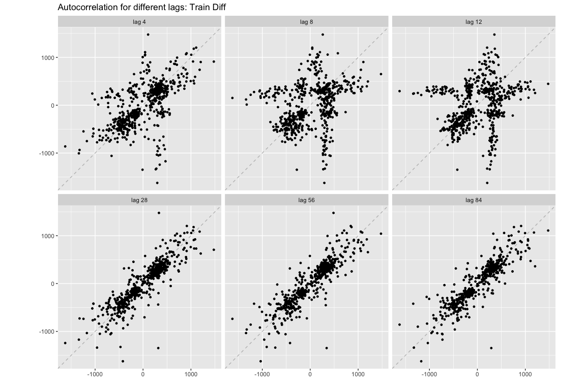<!-- -->

We looked at the lags for the differenced time series. We suspect that there is a positive autocorrelation at lag 4n because of assumed daily seasonality. The other place to check would be where the ACF's seasonal decay exhibited spikes at lag 28n. Looking at the plot above it's clear that this is a highly predictive lag.

Next we difference the series S=28 times for the D=1 seasonal difference. Here we can see what the order of the seasonal component would be.


```r
train_sdiff <- train_ts %>% diff() %>% diff(lag=28)

p1 <- train_sdiff %>% ggAcf() + ggtitle("ACF of Diff(28) data")
p2 <- train_sdiff %>% ggPacf() + ggtitle("PACF of Diff(28) data")
grid.arrange(p1, p2, nrow=2, ncol=1)
```

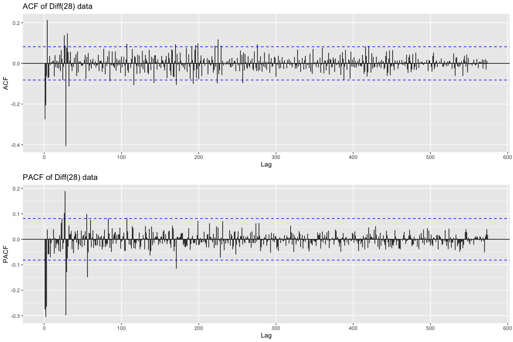<!-- -->


```r
# ACF of seasonal component
train_ts %>% diff() %>% diff(lag=28) %>% Acf(plot=FALSE, lag.max=30) 
```

```
## 
## Autocorrelations of series '.', by lag
## 
##      0      1      2      3      4      5      6      7      8      9 
##  1.000 -0.275 -0.206 -0.063  0.213 -0.073 -0.069  0.035 -0.008  0.006 
##     10     11     12     13     14     15     16     17     18     19 
##  0.002  0.010  0.014 -0.064  0.041 -0.018  0.013 -0.022  0.010 -0.026 
##     20     21     22     23     24     25     26     27     28     29 
##  0.042 -0.038  0.066  0.021 -0.082 -0.017  0.138  0.087 -0.406  0.078 
##     30 
##  0.148
```


```r
# PACF of seasonal component
train_ts %>% diff() %>% diff(lag=28) %>% Pacf(plot=FALSE, lag.max=30) 
```

```
## 
## Partial autocorrelations of series '.', by lag
## 
##      1      2      3      4      5      6      7      8      9     10 
## -0.275 -0.305 -0.264  0.038 -0.059 -0.058  0.005 -0.070 -0.015  0.000 
##     11     12     13     14     15     16     17     18     19     20 
## -0.004  0.040 -0.056  0.005 -0.035 -0.019 -0.012 -0.021 -0.046  0.016 
##     21     22     23     24     25     26     27     28     29     30 
## -0.049  0.064  0.082 -0.039 -0.015  0.103  0.189 -0.298 -0.129 -0.075
```

The ACF and PACF of the seasonal differenced data look very similar. There is a spike at lag 1 and at lag 28 (ACF) and lag 29 (PACF). Besides these two spikes, the rest of the values tend to stick around zero. This is indicative of an SMA(1) seasonal component. There doesn't appear to be any SAR(P) component. Since we took one seasonal difference, then D=1.

We will now __make an ARIMA model based on the ACF and PACF plots of the diff(1) and diff(28)__ version of our original data. 


## SARIMA Models


The first model is based on the model presented in the time series analysis book mixed with the seasonality that we observe in the Uber dataset. This is a model that is used in economics and was used to predict airline passengers in the book. 


```r
# Intuitive model based on the plots
m1 <- Arima(train_ts, 
      order=c(1, 1, 0), 
      seasonal=list(order=c(0,1,1), period=28))

yhat <- m1 %>% forecast(h=test_size)

# Plot the predictions
p1 <- yhat %>% autoplot() 
p2 <- ggAcf(residuals(m1)) + ggtitle("ACF of m1 Residuals")

grid.arrange(p1, p2, nrow=1, ncol=2)
```

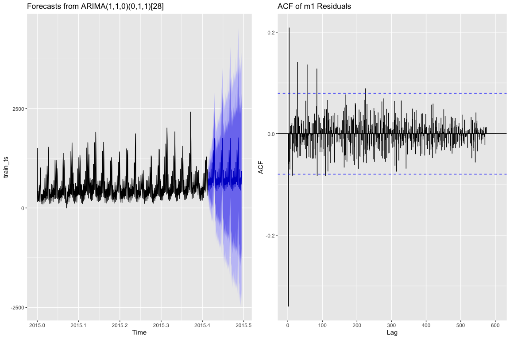<!-- -->

```r
# Print out summary of the coefficients
m1 %>% summary()
```

```
## Series: train_ts 
## ARIMA(1,1,0)(0,1,1)[28] 
## 
## Coefficients:
##           ar1     sma1
##       -0.3765  -0.9039
## s.e.   0.0426   0.0498
## 
## sigma^2 estimated as 26438:  log likelihood=-3766.04
## AIC=7538.09   AICc=7538.13   BIC=7551.15
## 
## Training set error measures:
##                    ME   RMSE      MAE MPE MAPE MASE        ACF1
## Training set 7.162789 158.37 98.86515 Inf  Inf  NaN -0.06150298
```

```r
m1_y <- m1 %>% forecast(h=test_size)
```

The pattern looks like it was captured in the predictive mean of the forecast, but the prediction intervals get really wide for forecasts beyond about 2 weeks. At this point, the prediction interval captures negative values. 

Next we use p=4 since this is what was uncovered in the ACF and PACF plots of the differenced time series.


```r
m2 <- Arima(train_ts, 
      order=c(4, 1, 0), 
      seasonal=list(order=c(0,1,1), period=28))


m2_y <- m2 %>% forecast(h=test_size)

p1 <- m2_y %>% autoplot()
p2 <- ggAcf(residuals(m2)) + ggtitle("ACF of Residuals")

grid.arrange(p1, p2, nrow=1, ncol=2)
```

<!-- -->

This second model dips below zero in the prediction interval after the first week. The AIC and BIC of this model are also lower than that of the first economic model.

The last model is one that is chosen by `auto.arima` on the basis of AIC. However, the function needs a time series with frequency defined and I struggled to understand the frequency parameter. I made a guess that it would be the number of days in a year (1 season) divided by the value of the season present in my data.


```r
# Auto arima with forced seasonality
train_seasonal <- ts(uber_train$East_Village, frequency=365.4/28)
m_auto <- auto.arima(train_seasonal, D=1) 
m_auto %>% forecast(h=test_size) %>% autoplot()
```

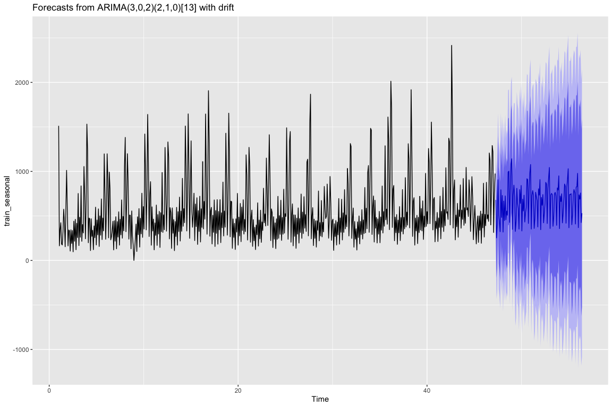<!-- -->

```r
m_auto_y <- m_auto %>% forecast(h=test_size)
```


```r
m_auto <- Arima(train_ts, 
      order=c(3, 0, 2), 
      seasonal=list(order=c(2,1,0), period=13))

m_auto_y <- m_auto %>% forecast(h=test_size)
```


```r
sfit <- snaive(train_ts) 
yhat_sfit <- sfit %>% forecast(h=test_size)
sfit %>% forecast(h=test_size) %>% autoplot()
```

<!-- -->


This model does worse than the first two. 


```r
# Comparison of model results
p1 <- ggplot()+
  geom_point(mapping=aes(x=y_test, y=yhat$mean))+
  xlim(min(y_test), max(y_test))+
  ylim(min(y_test), max(y_test))+
  ggtitle("Actual vs. Predicted (m1)")

p2 <- ggplot()+
  geom_point(mapping=aes(x=y_test, y=m2_y$mean))+
  xlim(min(y_test), max(y_test))+
  ylim(min(y_test), max(y_test))+
  ggtitle("Actual vs. Predicted (m2)")

grid.arrange(p1, p2, nrow=1, ncol=2)
```

<!-- -->


```r
m7 <- Arima(train_ts, 
      order=c(4, 1, 0), 
      seasonal=list(order=c(0,1,4), period=28))

m7_y <- m7 %>% forecast(h=test_size)

p1 <- m7_y %>% autoplot()
p2 <- ggAcf(residuals(m7)) + ggtitle("ACF of Residuals")

grid.arrange(p1, p2, nrow=1, ncol=2)
```

<!-- -->


```r
BIC(m2)
```

```
## [1] 7451.207
```

```r
BIC(m7)
```

```
## [1] 7460.809
```


```r
m8 <- Arima(train_ts, 
      order=c(3, 1, 0), 
      seasonal=list(order=c(0,1,1), period=28))

yhat8 <- m8 %>% forecast(h=test_size)

p1 <- yhat8 %>% autoplot()
p2 <- ggAcf(residuals(m8)) + ggtitle("ACF of Residuals")

grid.arrange(p1, p2, nrow=1, ncol=2)
```

<!-- -->

### Ljung-Box Tests


```r
# Ljung Box tests
fit_test <- sarima(train_ts, p=4, d=1, q=0, P=0, D=1,  Q=1, S=28)
```

```
## initial  value 5.311208 
## iter   2 value 5.032960
## iter   3 value 4.998857
## iter   4 value 4.975523
## iter   5 value 4.954112
## iter   6 value 4.942405
## iter   7 value 4.940943
## iter   8 value 4.940388
## iter   9 value 4.940332
## iter  10 value 4.940312
## iter  11 value 4.940312
## iter  11 value 4.940312
## iter  11 value 4.940312
## final  value 4.940312 
## converged
## initial  value 5.038459 
## iter   2 value 5.029919
## iter   3 value 5.027991
## iter   4 value 5.027361
## iter   5 value 5.027255
## iter   6 value 5.027223
## iter   7 value 5.027219
## iter   8 value 5.027219
## iter   8 value 5.027219
## iter   8 value 5.027219
## final  value 5.027219 
## converged
```

<!-- -->

```r
fit_test
```

```
## $fit
## 
## Call:
## stats::arima(x = xdata, order = c(p, d, q), seasonal = list(order = c(P, D, 
##     Q), period = S), include.mean = !no.constant, transform.pars = trans, fixed = fixed, 
##     optim.control = list(trace = trc, REPORT = 1, reltol = tol))
## 
## Coefficients:
##           ar1      ar2      ar3     ar4     sma1
##       -0.6154  -0.4844  -0.3696  0.0057  -0.8957
## s.e.   0.0467   0.0518   0.0517  0.0473   0.0477
## 
## sigma^2 estimated as 21472:  log likelihood = -3706.54,  aic = 7425.08
## 
## $degrees_of_freedom
## [1] 570
## 
## $ttable
##      Estimate     SE  t.value p.value
## ar1   -0.6154 0.0467 -13.1798  0.0000
## ar2   -0.4844 0.0518  -9.3553  0.0000
## ar3   -0.3696 0.0517  -7.1503  0.0000
## ar4    0.0057 0.0473   0.1202  0.9043
## sma1  -0.8957 0.0477 -18.7861  0.0000
## 
## $AIC
## [1] 12.33402
## 
## $AICc
## [1] 12.33419
## 
## $BIC
## [1] 12.37742
```

`m1` was pretty good but didn't pass the Ljung-Box test of significance. However `m2` did. And this also assumes normally-distributed errors which isn't exactly true with our data since it's Poisson distributed. 


## Poisson Models


```r
# One-hot encoding function for weekly seasonal variable
dmy <- dummyVars(~season, data = uber_train)
trainCovariates <- data.frame(predict(dmy ,newdata=data.frame(season=uber_train$season)))
testCovariates <- data.frame(predict(dmy ,newdata=data.frame(season=uber_test$season)))

# 
m3 <- tsglm(train_ts, model=list(past_obs=1, past_mean=1), distr="poisson", xreg=trainCovariates)

yhat_m3 <- predict(m3, n.ahead=test_size, newxreg=testCovariates)

predint_m3 <- data.frame(yhat_m3$interval)

ggplot()+
  geom_line(mapping=aes(x=time(train_ts), y=train_ts))+
  geom_ribbon(mapping=aes(x=time(test_ts), ymin=predint_m3$lower, ymax = predint_m3$upper), fill="blue", alpha=0.5)+
  geom_line(mapping=aes(x=time(test_ts), y=yhat_m3$median), color="blue")+
  ggtitle("Poisson GLM with ARMA(1,1) and Weekday Dummy Variable")
```

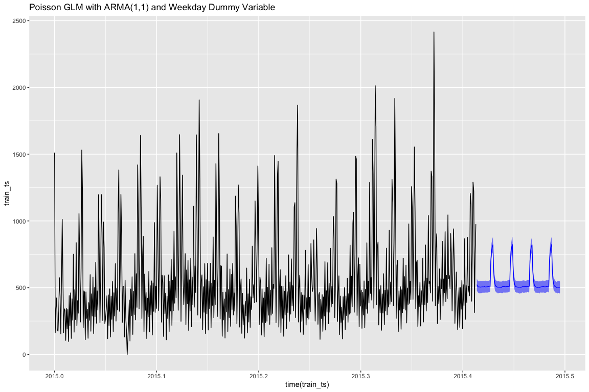<!-- -->


```r
m4 <- tsglm(train_ts, model=list(past_obs=1, past_mean=1), distr="poisson")

yhat_m4 <- predict(m4, n.ahead=test_size)

predint_m4 <- data.frame(yhat_m4$interval)

ggplot()+
  geom_line(mapping=aes(x=time(train_ts), y=train_ts))+
  geom_ribbon(mapping=aes(x=time(test_ts), ymin=predint_m4$lower, ymax = predint_m4$upper), fill="blue", alpha=0.5)+
  geom_line(mapping=aes(x=time(test_ts), y=yhat_m4$median), color="blue")+
  ggtitle("Poisson GLM with ARMA(1,1)")
```

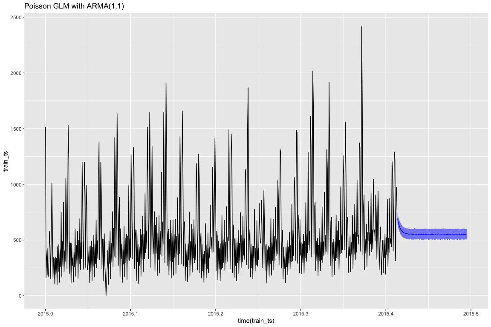<!-- -->


```r
m5 <- tsglm(train_ts, model=list(past_obs=28, past_mean=1), distr="poisson")

yhat_m5 <- predict(m5, n.ahead=test_size)

predint_m5 <- data.frame(yhat_m5$interval)

mean((y_test - yhat_m5$median)^2)
```

```
## [1] 53359.27
```

```r
ggplot()+
  geom_line(mapping=aes(x=time(train_ts), y=train_ts))+
  geom_ribbon(mapping=aes(x=time(test_ts), ymin=predint_m5$lower, ymax = predint_m5$upper), fill="blue", alpha=0.5)+
  geom_line(mapping=aes(x=time(test_ts), y=yhat_m5$median), color="blue")+
  ggtitle("Poisson GLM with ARMA(28,1)")
```

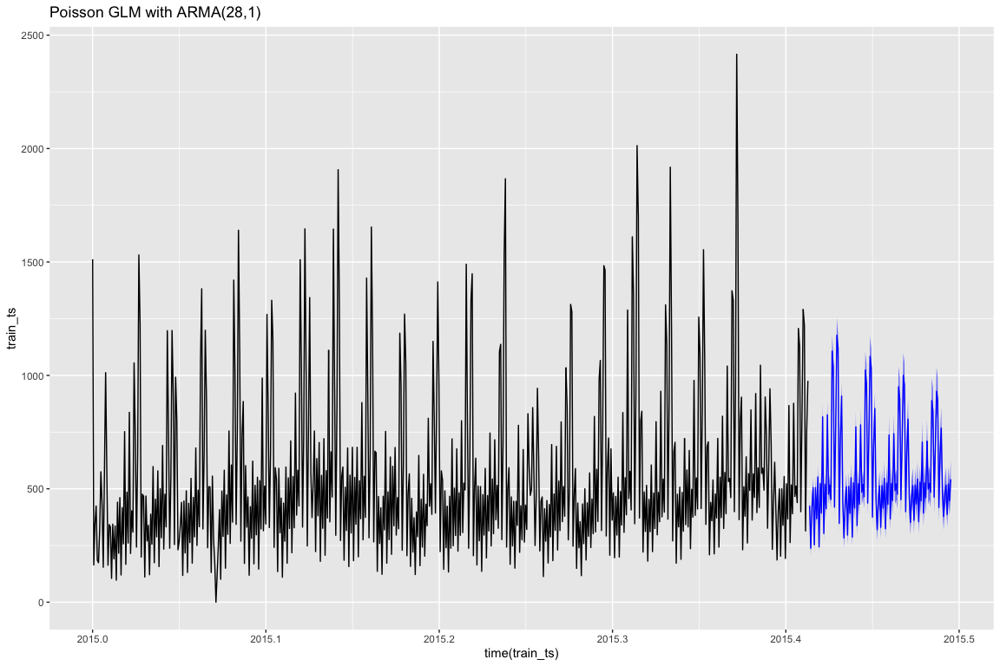<!-- -->

```r
m13 <- tsglm(train_ts, model=list(past_obs=28, past_mean=28), distr="poisson")

yhat_m6 <- predict(m13, n.ahead=test_size)

predint_m6 <- data.frame(yhat_m6$interval)

mean((y_test - yhat_m6$median)^2)
```

```
## [1] 29678.48
```

```r
ggplot()+
  geom_line(mapping=aes(x=time(train_ts), y=train_ts))+
  geom_ribbon(mapping=aes(x=time(test_ts), ymin=predint_m6$lower, ymax = predint_m6$upper), fill="blue", alpha=0.5)+
  geom_line(mapping=aes(x=time(test_ts), y=yhat_m6$median), color="blue")+
  ggtitle("Poisson GLM with ARMA(28,28)")
```

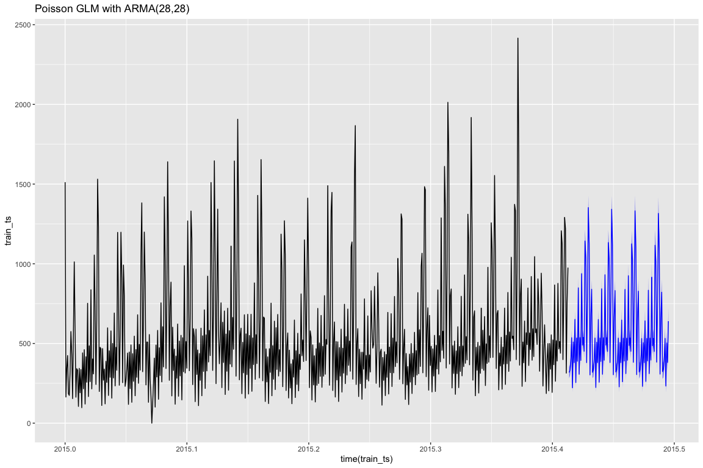<!-- -->


```r
dmy <- dummyVars(~season, data = uber_train)
trainCovariates <- data.frame(predict(dmy ,newdata=data.frame(season=uber_train$season)))
testCovariates <- data.frame(predict(dmy ,newdata=data.frame(season=uber_test$season)))

m6 <- tsglm(train_ts, model=list(past_obs=4, past_mean=1), distr="poisson", xreg=trainCovariates)
predint_m6 <- data.frame(yhat_m6$interval)

yhat_m6 <- predict(m6, n.ahead=test_size, newxreg=testCovariates)

ggplot()+
  geom_line(mapping=aes(x=time(train_ts), y=train_ts))+
  geom_ribbon(mapping=aes(x=time(test_ts), ymin=predint_m6$lower, ymax = predint_m6$upper), fill="blue", alpha=0.5)+
  geom_line(mapping=aes(x=time(test_ts), y=yhat_m6$median), color="blue")+
  ggtitle("Poisson GLM ARMA(4,1) and Weekday Dummy Variable")
```

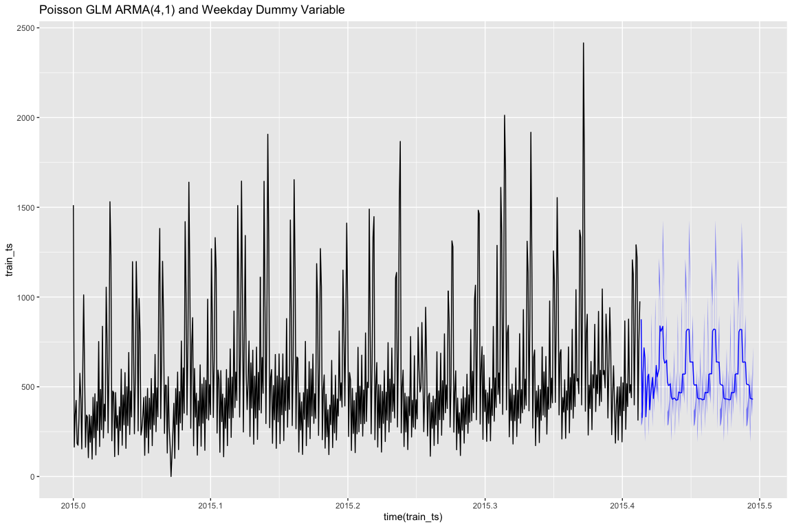<!-- -->


```r
train_freq <- ts(uber_train$East_Village, frequency=28)
test_freq <- ts(uber_test$East_Village, frequency=28)

train_freq %>% auto.arima() -> m10

p1 <- m10 %>% forecast(h=120) %>% autoplot()
p2 <- m10 %>% residuals() %>% ggAcf() + ggtitle("ACF of Residuals")

grid.arrange(p1, p2, nrow=1, ncol=2)
```

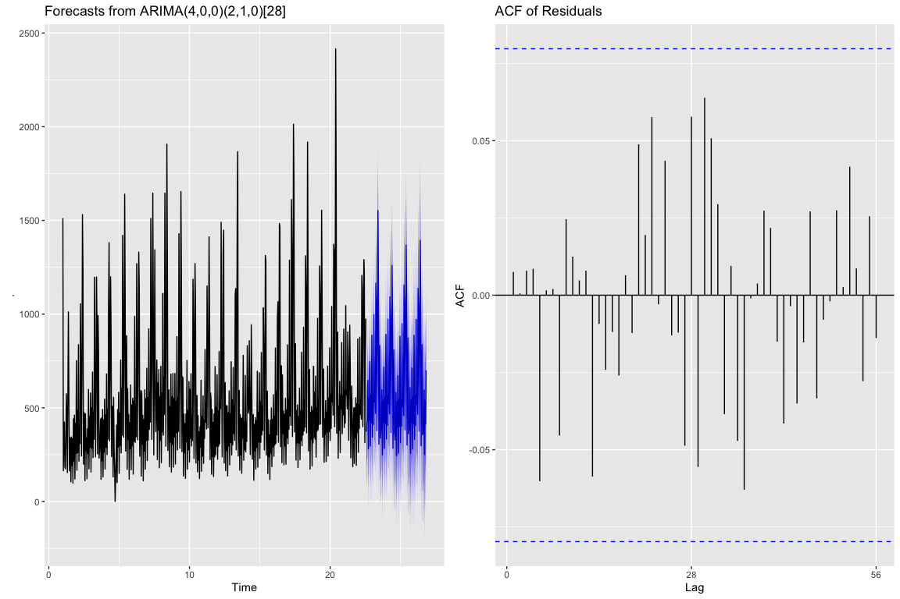<!-- -->


```r
checkresiduals(m10)
```

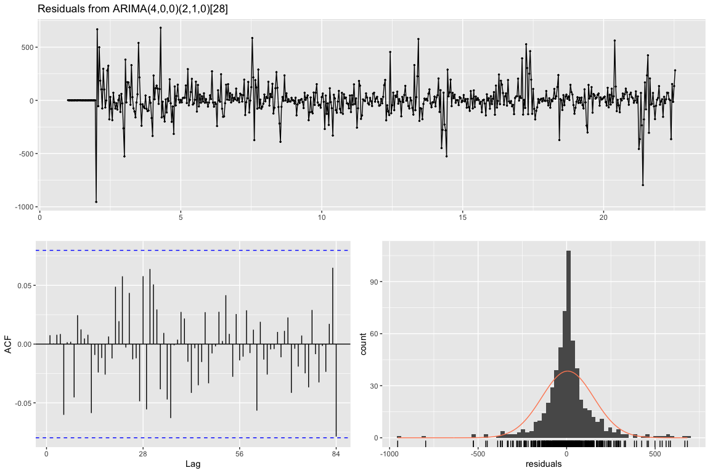<!-- -->

```
## 
## 	Ljung-Box test
## 
## data:  Residuals from ARIMA(4,0,0)(2,1,0)[28]
## Q* = 34.992, df = 50, p-value = 0.9469
## 
## Model df: 6.   Total lags used: 56
```


```r
naives_m <- Arima(train_ts, 
      order=c(0, 0, 0), 
      seasonal=list(order=c(0,1,0), period=28))

sfit <- train_ts %>% snaive(m=28) 
p1 <- naives_m %>% forecast(h=test_size) %>% autoplot(PI=FALSE)
p2 <- sfit %>% forecast(h=test_size) %>% autoplot()

grid.arrange(p1, p2, nrow=2, ncol=1)
```

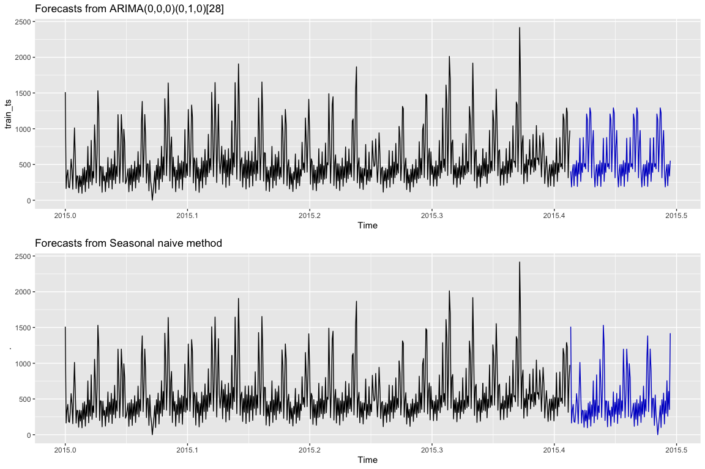<!-- -->


```r
sfit <- snaive(train_ts) 
yhat_sfit <- sfit %>% forecast(h=test_size)
sfit %>% forecast(h=test_size) %>% autoplot()
```

<!-- -->

## Accuracy Measures


```r
# SARIMA models
m1 <- Arima(train_ts, 
      order=c(1, 1, 0), 
      seasonal=list(order=c(0,1,1), period=28))

m2 <- Arima(train_ts, 
      order=c(4, 1, 0), 
      seasonal=list(order=c(0,1,1), period=28))

m3 <- Arima(train_ts, 
      order=c(4, 1, 0), 
      seasonal=list(order=c(0,1,4), period=28))

m4 <- Arima(train_ts, 
      order=c(3, 0, 2), 
      seasonal=list(order=c(2,1,0), period=13))

m5 <- Arima(train_ts, 
      order=c(4, 0, 0), 
      seasonal=list(order=c(2,1,0), period=28))

s_naive <- Arima(train_ts, 
      order=c(0, 0, 0), 
      seasonal=list(order=c(0,1,0), period=28))


yhat_m1 <- m1 %>% forecast(h=test_size)
yhat_m2 <- m2 %>% forecast(h=test_size)
yhat_m3 <- m3 %>% forecast(h=test_size)
yhat_m4 <- m4 %>% forecast(h=test_size)
yhat_m5 <- m5 %>% forecast(h=test_size)
yhat_naive <- s_naive %>% forecast(h=test_size)
```

