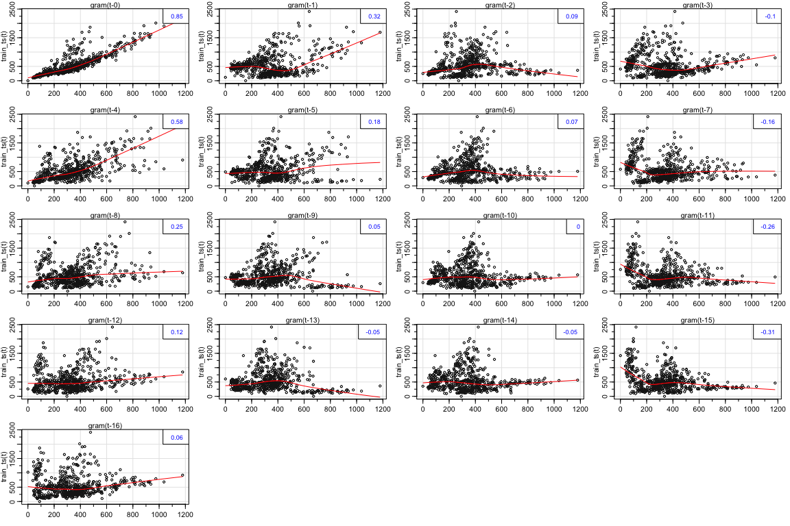
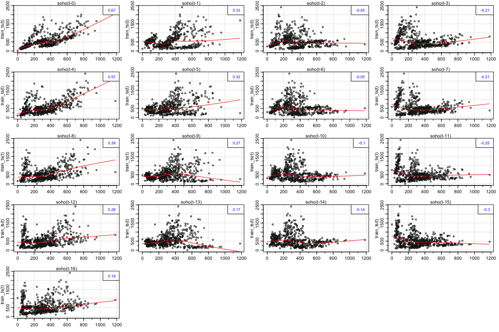
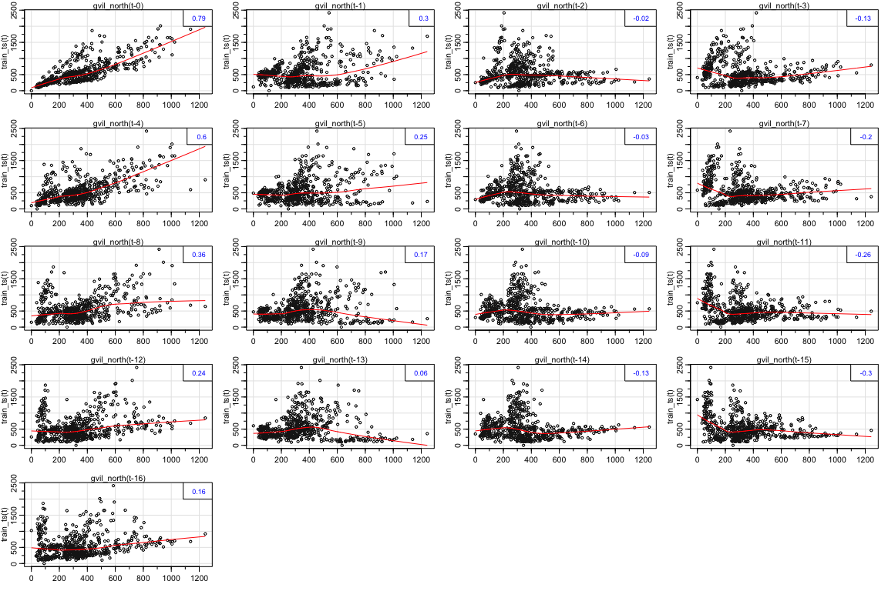
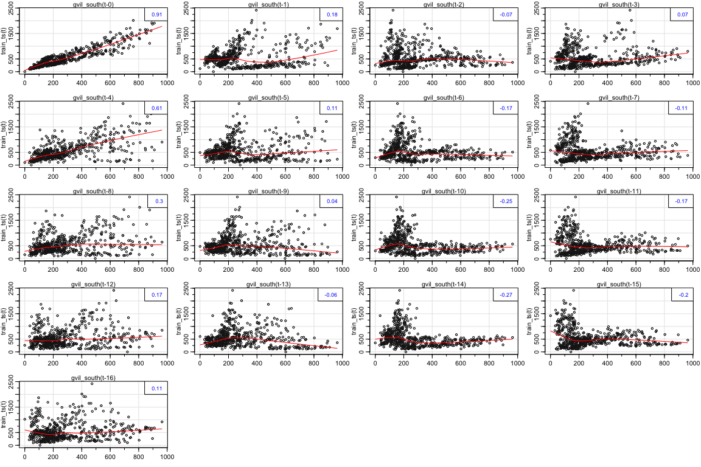
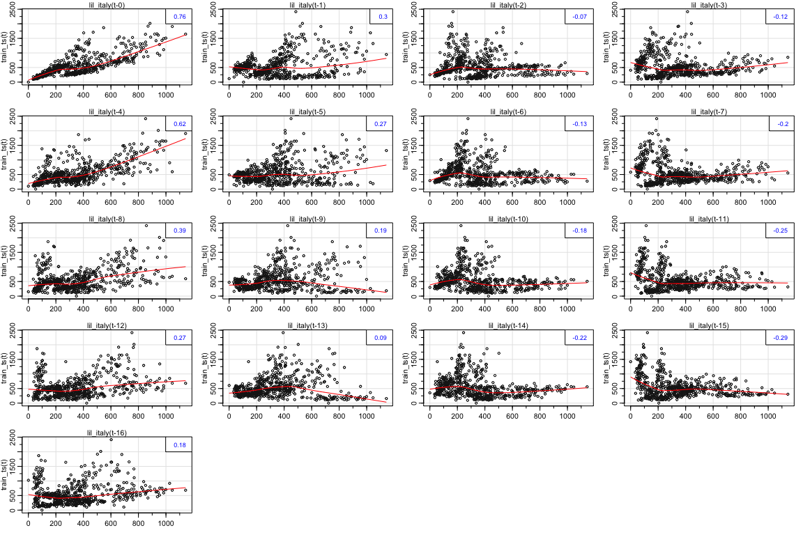
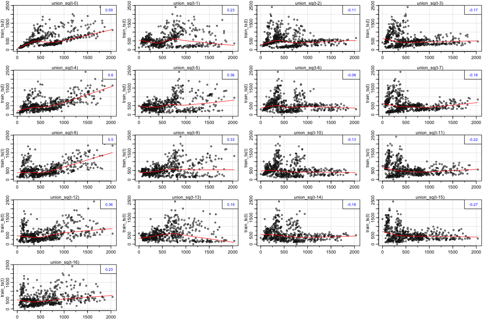

# Uber Cross-Correlation Analysis


We want to see the correlation between past values of nearby pickups and our current pickups data. We could construct a multivariate model this way. 


```r
library("forecast")
library("lubridate")
library("gridExtra")
library("tidyverse")
library("caret")
library("astsa")
```


```r
# Load in data
uber_6h <- read_csv('../../data/uber_pickups_lower_manhattan_wide_6h.csv') # Point this to the directory and file

# Train Test Split Dataframe
uber_train <- uber_6h %>% filter(Pickup_date < ymd_hms("2015-06-01 00:00:00")) # This gives us a training set for all 8 locations

# Turn into time series
train_ts <- msts(uber_train$East_Village,
                    start=decimal_date(ymd_hms("2015-01-01 00:00:00")),
                    seasonal.periods=c(4, 1461))
```


```r
# Make time series objects for each one of the locations
gram <- uber_train$Gramercy %>% msts(start=decimal_date(ymd_hms("2015-01-01 00:00:00")), seasonal.periods=c(4, 1461))

gvil_north <- uber_train$GVillage_N %>% msts(start=decimal_date(ymd_hms("2015-01-01 00:00:00")), seasonal.periods=c(4, 1461))

gvil_south <- uber_train$GVillage_S %>% msts(start=decimal_date(ymd_hms("2015-01-01 00:00:00")), seasonal.periods=c(4, 1461))

lil_italy <- uber_train$Little_Italy %>% msts(start=decimal_date(ymd_hms("2015-01-01 00:00:00")), seasonal.periods=c(4, 1461))

les <- uber_train$LES %>% msts(start=decimal_date(ymd_hms("2015-01-01 00:00:00")), seasonal.periods=c(4, 1461))

soho <- uber_train$SoHo %>% msts(start=decimal_date(ymd_hms("2015-01-01 00:00:00")), seasonal.periods=c(4, 1461))

union_sq <- uber_train$Union_Sq %>% msts(start=decimal_date(ymd_hms("2015-01-01 00:00:00")), seasonal.periods=c(4, 1461))
```

---

## Grammercy


```r
lag2.plot(gram, train_ts, 16)
```

<!-- -->

---

## Soho


```r
# Soho
lag2.plot(soho, train_ts, 16)
```

<!-- -->

---

## Greenwich Village North


```r
lag2.plot(gvil_north, train_ts, 16)
```

<!-- -->

---

## Greenwich Village South


```r
lag2.plot(gvil_south, train_ts, 16)
```

<!-- -->

---

## Little Italy

```r
lag2.plot(lil_italy, train_ts, 16)
```

<!-- -->

---

## Lower East Side

```r
lag2.plot(les, train_ts, 16)
```

<!-- -->

---

## Union Square Park

```r
lag2.plot(union_sq, train_ts, 16)
```

<!-- -->


