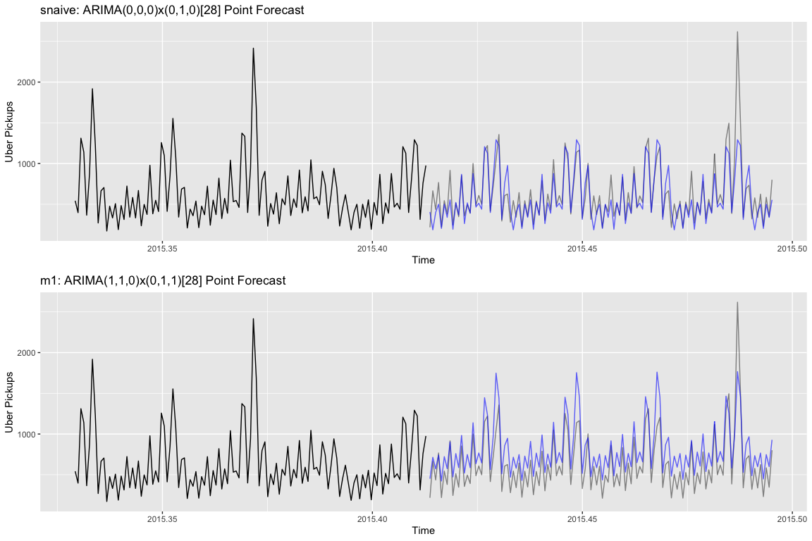
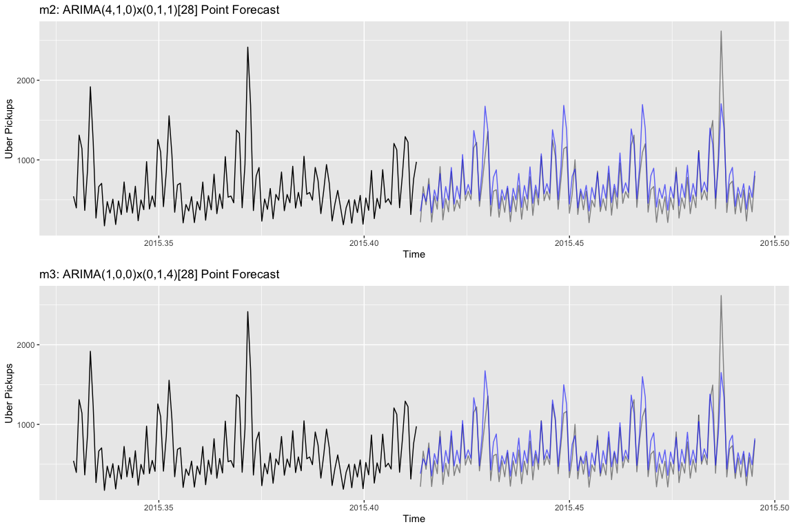
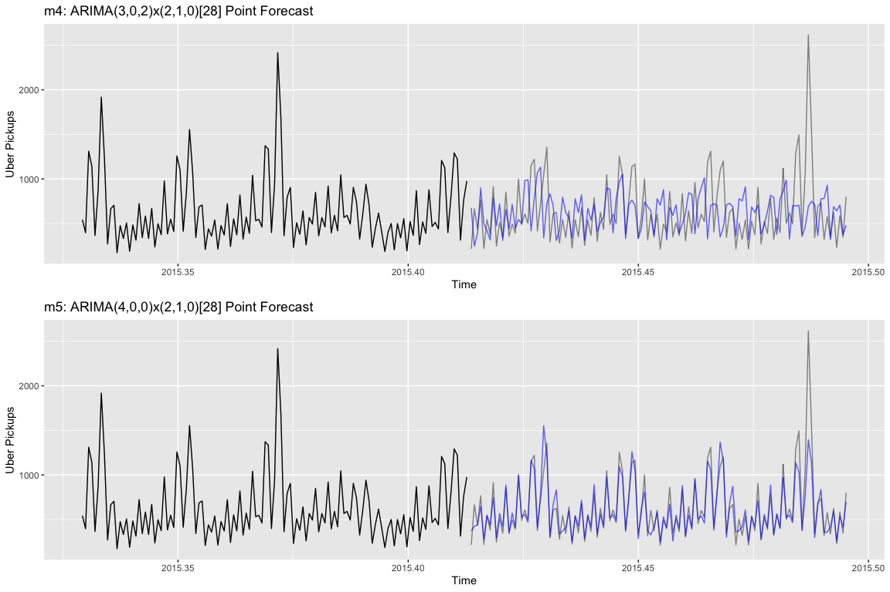
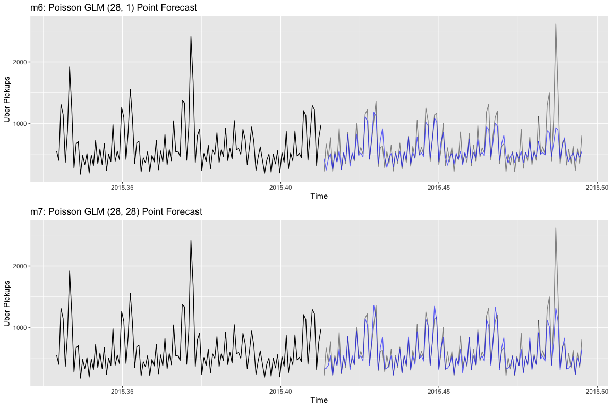

# Final Results

```r
library("forecast")
library("lubridate")
library("gridExtra")
library("tidyverse")
library("caret")
library("tscount")
library("kableExtra")
```


```r
# Input data

uber_6h <- read_csv('../../data/uber_pickups_lower_manhattan_wide_6h.csv') # Point this to the directory and file

uber_train <- uber_6h %>% filter(Pickup_date < ymd_hms("2015-06-01 00:00:00")) # This gives us a training set for all 8 locations
uber_test <- uber_6h %>% filter(Pickup_date >= ymd_hms("2015-06-01 00:00:00"))

# Training Time Series
train_ts <- msts(uber_train$East_Village,
                    start=decimal_date(ymd_hms("2015-01-01 00:00:00")),
                    seasonal.periods=c(4, 1461))


test_ts <- msts(uber_test$East_Village,
                    start=decimal_date(ymd_hms("2015-06-01 00:00:00")),
                    seasonal.periods=c(4, 1461))


y_test <- as.numeric(test_ts)
test_size <- length(y_test)
```

### Model Fitting


```r
set.seed(12)
s_naive <- Arima(train_ts, 
      order=c(0, 0, 0), 
      seasonal=list(order=c(0,1,0), period=28))

# SARIMA models
m1 <- Arima(train_ts, 
      order=c(1, 1, 0), 
      seasonal=list(order=c(0,1,1), period=28))

m2 <- Arima(train_ts, 
      order=c(4, 1, 0), 
      seasonal=list(order=c(0,1,1), period=28))

m3 <- Arima(train_ts, 
      order=c(4, 1, 0), 
      seasonal=list(order=c(0,1,4), period=28))

m4 <- Arima(train_ts, 
      order=c(3, 0, 2), 
      seasonal=list(order=c(2,1,0), period=13))

m5 <- Arima(train_ts, 
      order=c(4, 0, 0), 
      seasonal=list(order=c(2,1,0), period=28))

m6 <- tsglm(train_ts, model=list(past_obs=28, past_mean=1), distr="poisson")


m7 <- tsglm(train_ts, model=list(past_obs=28, past_mean=28), distr="poisson")
```


### Forecasts


```r
# Forecast objects
yforc_snaive <- s_naive %>% forecast(h=test_size)

yforc_m1 <- m1 %>% forecast(h=test_size)

yforc_m2 <- m2 %>% forecast(h=test_size)

yforc_m3 <- m3 %>% forecast(h=test_size)

yforc_m4 <- m4 %>% forecast(h=test_size)

yforc_m5 <- m5 %>% forecast(h=test_size)

yforc_m6 <- predict(m6, n.ahead=test_size)

yforc_m7 <- predict(m7, n.ahead=test_size)
```


```r
# Forecast vectors for MSE and MAE
yhat_snaive <- yforc_snaive$mean
  
yhat_m1 <- yforc_m1$mean

yhat_m2 <- yforc_m2$mean

yhat_m3 <- yforc_m3$mean

yhat_m4 <- yforc_m4$mean

yhat_m5 <- yforc_m5$mean

yhat_m6 <- yforc_m6$median

yhat_m7 <- yforc_m7$median
```

### Accuracy Measures


```r
mse <- function(y_test, y_hat){
  model_mse <- mean((y_test - y_hat)^2) %>% round(digits=2)
  print(model_mse)
}

mae <- function(y_test, y_hat){
  model_mae <- mean(abs(y_test - y_hat)) %>% round(digits=2)
  print(model_mae)
}
```


```r
# Mean Square Error
mse_snaive <- mse(y_test, yhat_snaive)
mse_m1 <- mse(y_test, yhat_m1)
mse_m2 <- mse(y_test, yhat_m2)
mse_m3 <- mse(y_test, yhat_m3)
mse_m4 <- mse(y_test, yhat_m4)
mse_m5 <- mse(y_test, yhat_m5)
mse_m6 <- mse(y_test, yhat_m6)
mse_m7 <- mse(y_test, yhat_m7)
```

```r
# Mean Absolute Error
mae_snaive <- mae(y_test, yhat_snaive)
mae_m1 <- mae(y_test, yhat_m1)
mae_m2 <- mae(y_test, yhat_m2)
mae_m3 <- mae(y_test, yhat_m3)
mae_m4 <- mae(y_test, yhat_m4)
mae_m5 <- mae(y_test, yhat_m5)
mae_m6 <- mae(y_test, yhat_m6)
mae_m7 <- mae(y_test, yhat_m7)
```

### Forecast Plots


```r
grid.arrange(p0, p1, nrow=2, ncol=1)
```

<!-- -->


```r
grid.arrange(p2, p3, nrow=2, ncol=1)
```

<!-- -->


```r
grid.arrange(p4, p5, nrow=2, ncol=1)
```

<!-- -->


```r
grid.arrange(p6, p7, nrow=2, ncol=1)
```

<!-- -->

### Top Models


```r
# Best Models

mean_sq <- c(mse_snaive, mse_m1, mse_m2, mse_m3, mse_m4, mse_m5, mse_m6, mse_m7)
mses <- c(mse_snaive, mse_m1, mse_m2, mse_m3, mse_m4, mse_m5, mse_m6, mse_m7) %>% formatC(format="f", big.mark=",", digits=2)
maes <- c(mae_snaive, mae_m1, mae_m2, mae_m3, mae_m4, mae_m5, mae_m6, mae_m7) %>% formatC(format="f", big.mark=",", digits=2)

metrics <- data.frame(cbind(models, mod_names, mses, maes)) # models and mod_names are string vectors with text
names(metrics) <- c("Model", "Model Name", "Mean Squared Error", "Mean Absolute Error")

metrics[order(mean_sq),]  %>% kable() %>% kable_styling()
```

<table class="table" style="margin-left: auto; margin-right: auto;">
 <thead>
  <tr>
   <th style="text-align:left;">   </th>
   <th style="text-align:left;"> Model </th>
   <th style="text-align:left;"> Model Name </th>
   <th style="text-align:left;"> Mean Squared Error </th>
   <th style="text-align:left;"> Mean Absolute Error </th>
  </tr>
 </thead>
<tbody>
  <tr>
   <td style="text-align:left;"> 6 </td>
   <td style="text-align:left;"> m5 </td>
   <td style="text-align:left;"> ARIMA(4,0,0)x(2,1,0)[28] </td>
   <td style="text-align:left;"> 27,062.21 </td>
   <td style="text-align:left;"> 90.96 </td>
  </tr>
  <tr>
   <td style="text-align:left;"> 4 </td>
   <td style="text-align:left;"> m3 </td>
   <td style="text-align:left;"> ARIMA(4,1,0)x(0,1,4)[28] </td>
   <td style="text-align:left;"> 29,383.73 </td>
   <td style="text-align:left;"> 129.06 </td>
  </tr>
  <tr>
   <td style="text-align:left;"> 8 </td>
   <td style="text-align:left;"> m7 </td>
   <td style="text-align:left;"> Poisson (28,28) </td>
   <td style="text-align:left;"> 29,661.42 </td>
   <td style="text-align:left;"> 90.30 </td>
  </tr>
  <tr>
   <td style="text-align:left;"> 3 </td>
   <td style="text-align:left;"> m2 </td>
   <td style="text-align:left;"> ARIMA(4,1,0)x(0,1,1)[28] </td>
   <td style="text-align:left;"> 32,773.05 </td>
   <td style="text-align:left;"> 141.13 </td>
  </tr>
  <tr>
   <td style="text-align:left;"> 1 </td>
   <td style="text-align:left;"> snaive </td>
   <td style="text-align:left;"> ARIMA(0,0,0)x(0,1,0)[28] </td>
   <td style="text-align:left;"> 36,549.64 </td>
   <td style="text-align:left;"> 111.92 </td>
  </tr>
  <tr>
   <td style="text-align:left;"> 7 </td>
   <td style="text-align:left;"> m6 </td>
   <td style="text-align:left;"> Poisson (28,1) </td>
   <td style="text-align:left;"> 53,459.47 </td>
   <td style="text-align:left;"> 133.06 </td>
  </tr>
  <tr>
   <td style="text-align:left;"> 2 </td>
   <td style="text-align:left;"> m1 </td>
   <td style="text-align:left;"> ARIMA(1,1,0)x(0,1,1)[28] </td>
   <td style="text-align:left;"> 54,011.54 </td>
   <td style="text-align:left;"> 202.27 </td>
  </tr>
  <tr>
   <td style="text-align:left;"> 5 </td>
   <td style="text-align:left;"> m4 </td>
   <td style="text-align:left;"> ARIMA(3,0,2)x(2,1,0)[13] </td>
   <td style="text-align:left;"> 146,771.49 </td>
   <td style="text-align:left;"> 287.27 </td>
  </tr>
</tbody>
</table>

