```r
library(tidyverse)
library(lubridate)
library(gridExtra)
library(forecast)
```


```r
uber_1h <- read_csv('../../data/uber_pickups_lower_manhattan_wide_1h.csv')
uber_6h <- read_csv('../../data/uber_pickups_lower_manhattan_wide_6h.csv')
```


```r
head(uber_1h)
```

```
## # A tibble: 6 x 9
##   Pickup_date         East_Village Gramercy GVillage_N GVillage_S
##   <dttm>                     <dbl>    <dbl>      <dbl>      <dbl>
## 1 2015-01-01 00:00:00          273      128        122        165
## 2 2015-01-01 01:00:00          285      117        127        147
## 3 2015-01-01 02:00:00          417      156        117        148
## 4 2015-01-01 03:00:00          308       96         77        129
## 5 2015-01-01 04:00:00          155       49         52         59
## 6 2015-01-01 05:00:00           74       19         10         17
## # … with 4 more variables: Little_Italy <dbl>, LES <dbl>, SoHo <dbl>,
## #   Union_Sq <dbl>
```

```r
head(uber_6h)
```

```
## # A tibble: 6 x 9
##   Pickup_date         East_Village Gramercy GVillage_N GVillage_S
##   <dttm>                     <dbl>    <dbl>      <dbl>      <dbl>
## 1 2015-01-01 00:00:00         1512      565        505        665
## 2 2015-01-01 06:00:00          164       78         42         42
## 3 2015-01-01 12:00:00          344      165        142        132
## 4 2015-01-01 18:00:00          424      201        180        156
## 5 2015-01-02 00:00:00          185       72         50         60
## 6 2015-01-02 06:00:00          174      115         91         53
## # … with 4 more variables: Little_Italy <dbl>, LES <dbl>, SoHo <dbl>,
## #   Union_Sq <dbl>
```


```r
nrow(uber_1h)
```

```
## [1] 4344
```

```r
nrow(uber_6h)
```

```
## [1] 724
```


```r
max(uber_1h$Pickup_date)
```

```
## [1] "2015-06-30 23:00:00 UTC"
```


```r
str(uber_1h)
```

```
## Classes 'spec_tbl_df', 'tbl_df', 'tbl' and 'data.frame':	4344 obs. of  9 variables:
##  $ Pickup_date : POSIXct, format: "2015-01-01 00:00:00" "2015-01-01 01:00:00" ...
##  $ East_Village: num  273 285 417 308 155 74 45 32 18 12 ...
##  $ Gramercy    : num  128 117 156 96 49 19 17 10 11 12 ...
##  $ GVillage_N  : num  122 127 117 77 52 10 7 5 5 8 ...
##  $ GVillage_S  : num  165 147 148 129 59 17 15 8 4 4 ...
##  $ Little_Italy: num  120 154 193 154 49 24 16 5 7 7 ...
##  $ LES         : num  203 224 301 230 103 47 26 19 6 10 ...
##  $ SoHo        : num  110 112 103 88 37 12 8 1 6 6 ...
##  $ Union_Sq    : num  176 233 309 160 49 22 15 3 12 8 ...
##  - attr(*, "spec")=
##   .. cols(
##   ..   Pickup_date = col_datetime(format = ""),
##   ..   East_Village = col_double(),
##   ..   Gramercy = col_double(),
##   ..   GVillage_N = col_double(),
##   ..   GVillage_S = col_double(),
##   ..   Little_Italy = col_double(),
##   ..   LES = col_double(),
##   ..   SoHo = col_double(),
##   ..   Union_Sq = col_double()
##   .. )
```

## Train-test split

We will use the first five months as training data and predict Uber pickups for June 2015 in the East Village. The date is in positx format which can be parsed using the lubridate package. 

Statistical forecasting techniques are used on the East Village training data, and will be evaluated on East Village test data. 


```r
# Split dataset into two time windows.
train_full_1h <- uber_1h %>% filter(Pickup_date < ymd_hms("2015-06-01 00:00:00"))
test_full_1h <- uber_1h %>% filter(Pickup_date >= ymd_hms("2015-06-01 00:00:00"))

# Split the 6-hour interval dataset to train/test
train_full_6h <- uber_6h %>% filter(Pickup_date < ymd_hms("2015-06-01 00:00:00"))
test_full_6h <- uber_6h %>% filter(Pickup_date >= ymd_hms("2015-06-01 00:00:00"))
```


## Convert to time series format

Next we will turn the train and test datasets into time series.


```r
full_ts <- msts(uber_6h$East_Village,
                    start=decimal_date(ymd_hms("2015-01-01 00:00:00")),
                    seasonal.periods=c(4, 1461))

train_ts <- window(full_ts, end=decimal_date(ymd_hms("2015-06-01 00:00:00")))

test_ts <- window(full_ts, start=decimal_date(ymd_hms("2015-06-01 00:00:00")))
```


```r
p1 <- full_ts %>% autoplot(series="All Trips") + 
  ggtitle("Full Dataset") +
  guides(colour=guide_legend("Data"))+
  scale_color_manual(values=c("black"))
  
p2 <- autoplot(train_ts, series="Training")+
  autolayer(test_ts,  series="Validation")+
  guides(colour=guide_legend("Split"))+
  scale_color_manual(values=c("black", "grey"))+
  ggtitle("Train/Test Split")

grid.arrange(p1, p2, nrow=2, ncol=1)
```

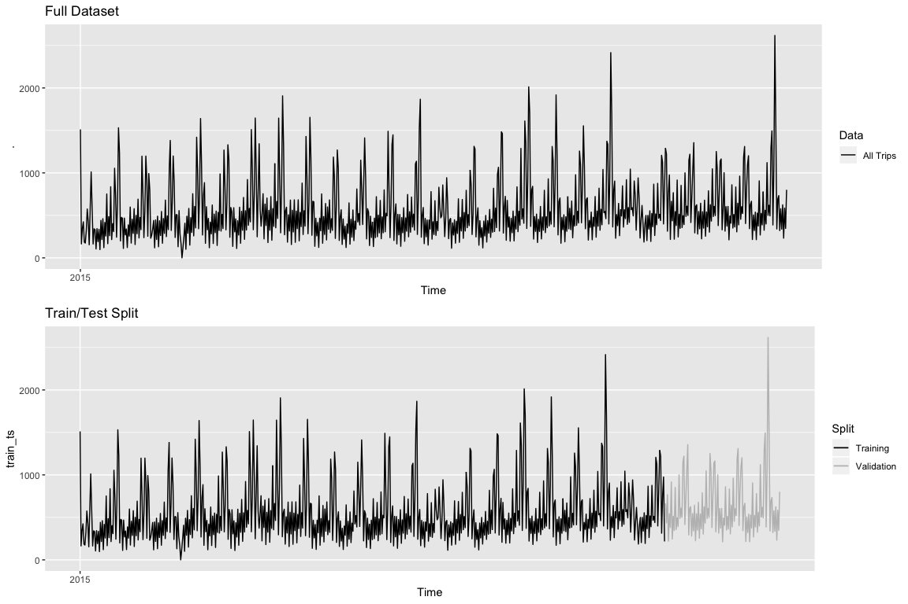<!-- -->


```r
ev <- train_full_1h %>% select(Pickup_date, East_Village) 
ggplot(ev)+
  geom_line(mapping=aes(x=Pickup_date, y=East_Village))+
  ggtitle("Hourly Uber Pickup Data")
```

<!-- -->


```r
ev_6 <- train_full_6h %>% select(Pickup_date, East_Village) 
ggplot(ev_6)+
  geom_line(mapping=aes(x=Pickup_date, y=East_Village))+
  ggtitle("Hourly Uber Pickup Data (6 hour windows)")
```

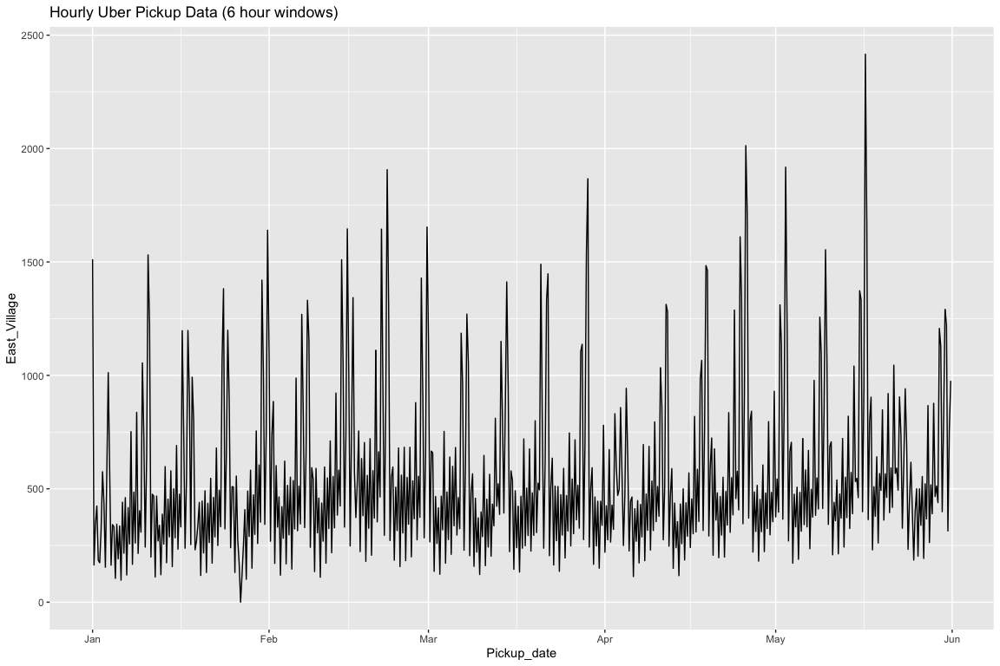<!-- -->

```r
ev_jan <- train_full_1h %>% select(Pickup_date, East_Village) %>% filter(Pickup_date < ymd_hms("2015-03-01 00:00:00")) 
ev_6_jan <- train_full_6h %>% select(Pickup_date, East_Village) %>% filter(Pickup_date < ymd_hms("2015-03-01 00:00:00")) 

p1 <- ggplot(ev_jan)+
  geom_line(mapping=aes(x=Pickup_date, y=East_Village))+
  ggtitle("Hourly Uber Pickup Data (1 hour windows)")

p2 <- ggplot(ev_6_jan)+
  geom_line(mapping=aes(x=Pickup_date, y=East_Village))+
  ggtitle("Hourly Uber Pickup Data (6 hour windows)")

grid.arrange(p1, p2, nrow=2, ncol=1)
```

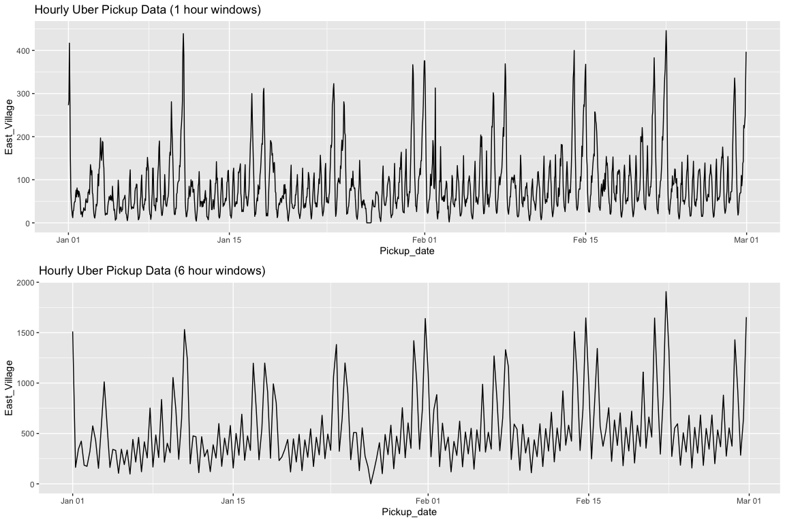<!-- -->


It looks like the 6 hour windows are better. We can use this data and model the demand per "shift" in a day.

- 12:00am - 5:59am - Graveyard Shift
- 6:00am - 11:59am - Morning Shift
- 12:00pm - 5:59pm - Afternoon Shift
- 6:00pm - 11:59pm - Evening Shift

Note that `train_full_1h`  and `train_full_6h` has the other time series for cross-correlation analysis. We do not need `test_full_1h` or `test_full_6h` anymore.


## Moving Average Filter


```r
train_ts %>% autoplot(series="Original Data")+
  autolayer(ma(train_ts, 4), series="Moving Average")+
  guides(colour=guide_legend("Split"))+
  scale_color_manual(values=c("black", "grey"))+
  ggtitle("Moving Average of Training Data")
```

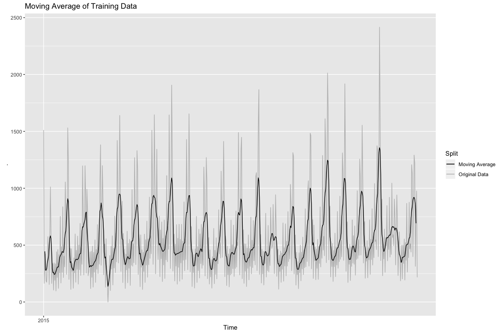<!-- -->

This helps with telling the seasonality of the data.

## Autocorrelation and Partial Autocorrelation


```r
p1 <- ggAcf(train_ts)
p2 <- ggPacf(train_ts)
grid.arrange(p1, p2, nrow=2, ncol=1)
```

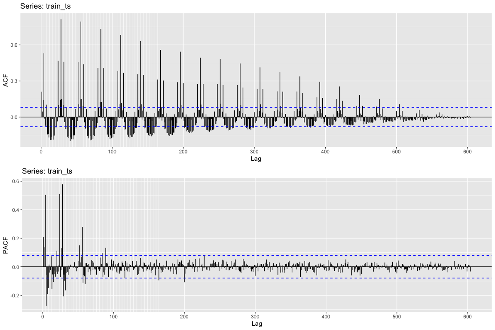<!-- -->


Doesn't look stationary. Is there a trend?


```r
lm(train_ts ~ time(train_ts)) %>% fitted() -> yhat.lm
autoplot(train_ts) + 
  geom_line(mapping=aes(x=time(train_ts), y=yhat.lm), color="red")+
  ggtitle("Linear Trend Fit")+
  xlab("Time")+
  ylab("Pickups")
```

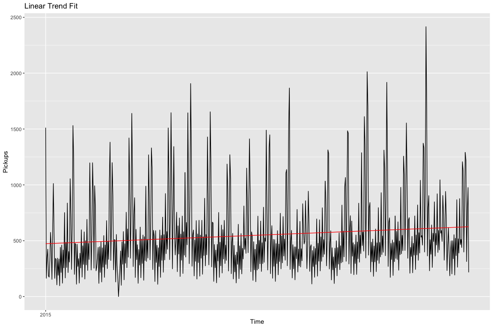<!-- -->

There is a slight linear trend. 

## Differencing 


```r
train_diff <- diff(train_ts)

train_diff %>% autoplot() + ggtitle("Differenced Pickup Data") + ylab("Change in Pickups")
```

<!-- -->


```r
ggAcf(train_diff)
```

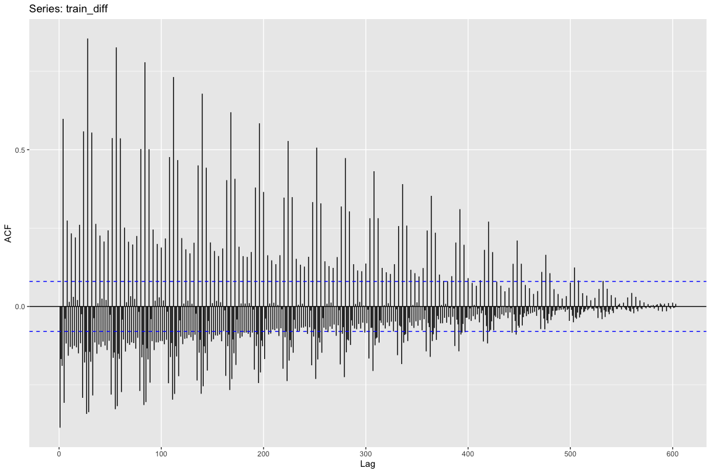<!-- -->


## Zoom in


```r
diffwin <- train_diff %>% window(end=decimal_date(ymd_hms("2015-03-01 00:00:00"))) 
diffwin %>% autoplot() + ggtitle("Differenced Pickups from January to March 2015")
```

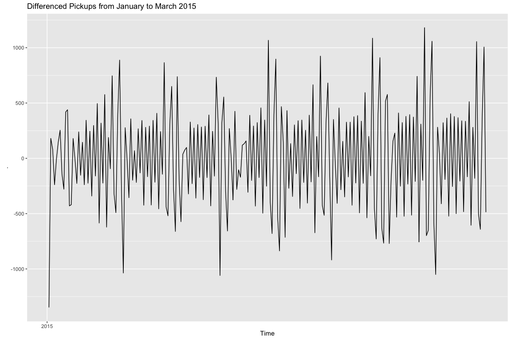<!-- -->


```r
month_line <- geom_vline(xintercept = decimal_date(ymd_hms("2015-02-01 00:00:00")), linetype="dashed", 
                color = "blue", size=0.5)

diffwin %>% autoplot(series="Original Data")+
  autolayer(ma(diffwin, 4), series="Moving Average")+
  month_line + 
  guides(colour=guide_legend("Split"))+
  scale_color_manual(values=c("black", "grey"))+
  ggtitle("Moving Average of Training Data")
```

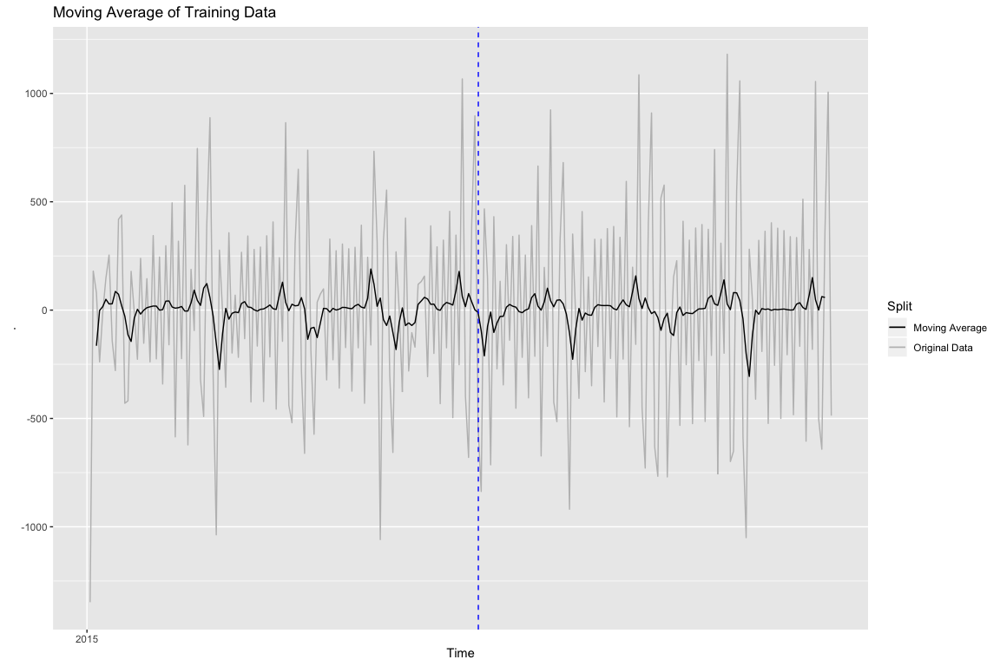<!-- -->


```r
train_diff %>% window(end=decimal_date(ymd_hms("2015-03-01 00:00:00"))) %>% ggAcf()
```

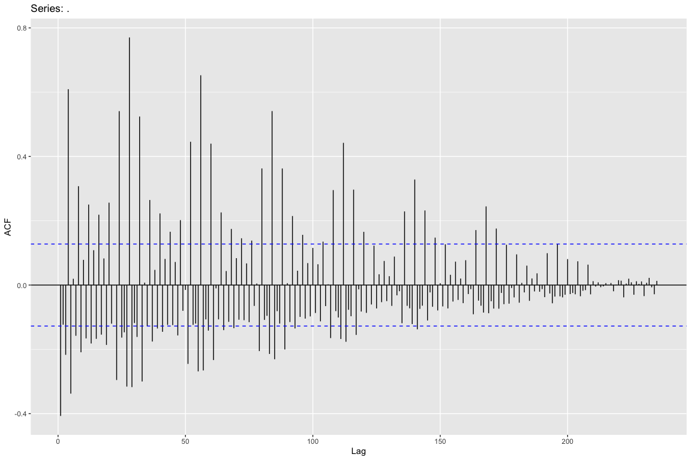<!-- -->


```r
train_diff %>% window(end=decimal_date(ymd_hms("2015-03-01 00:00:00"))) %>% ggPacf()
```

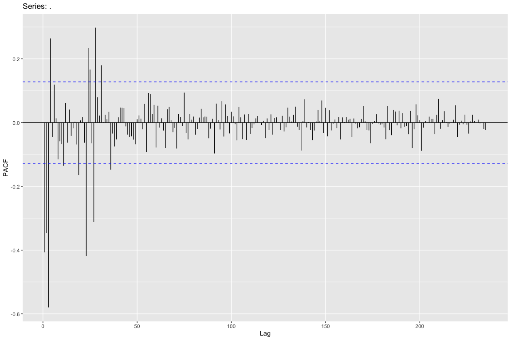<!-- -->

There is clear seasonality and a sharp cutoff after lag 26-ish. Each lag is 1 shift, so 24 shifts would be 6 days of pickups, 26 shifts would be 6.5 days of pickups (evening shift of the 6th day).


