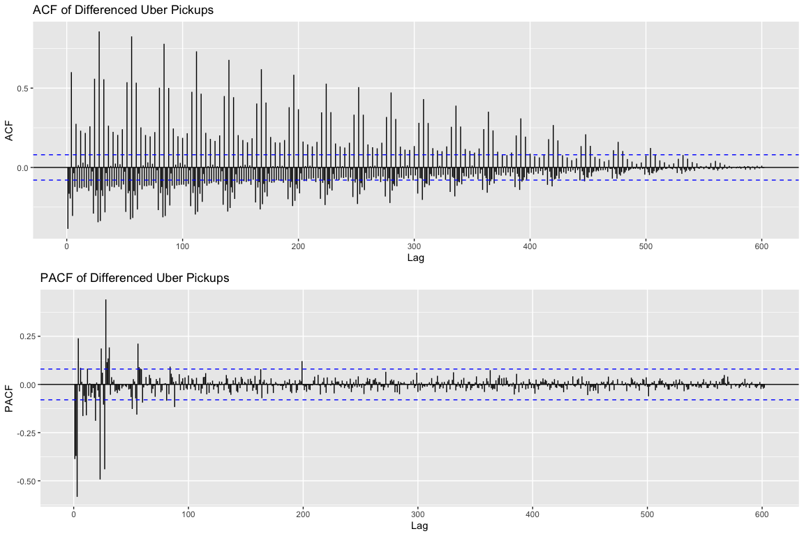
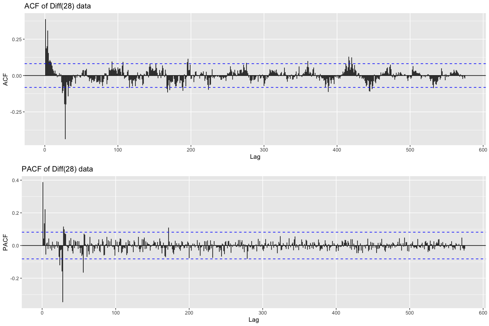
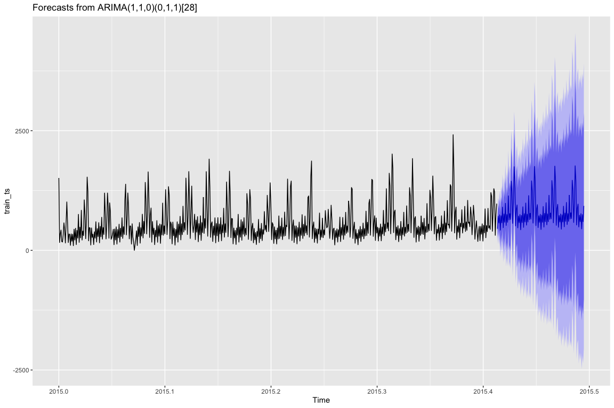
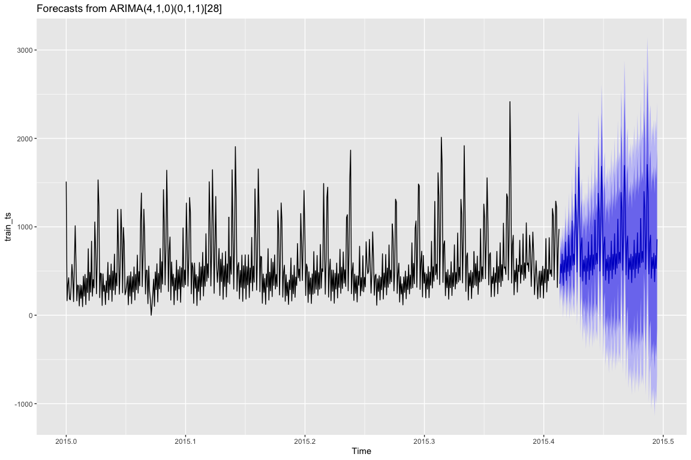
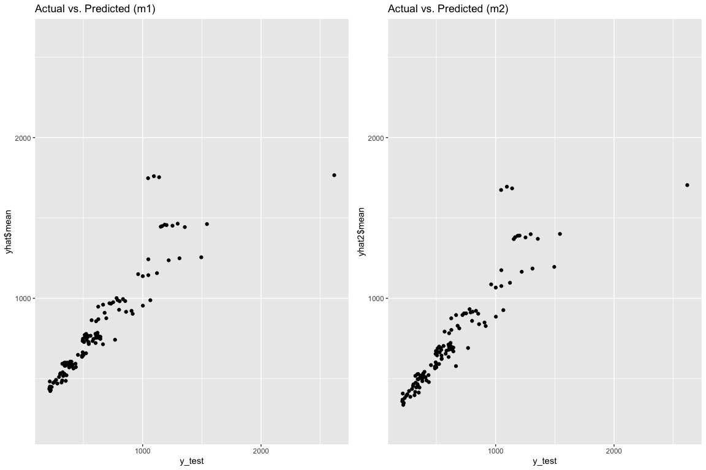
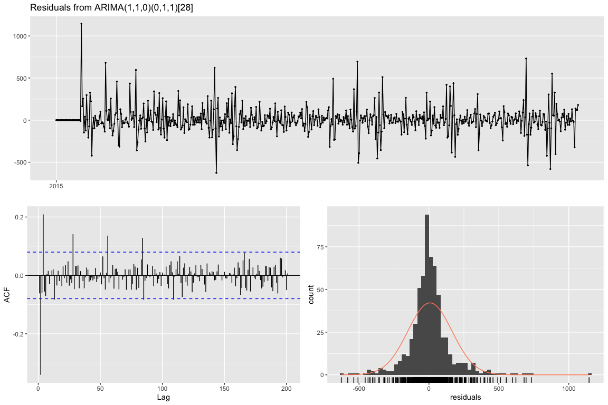
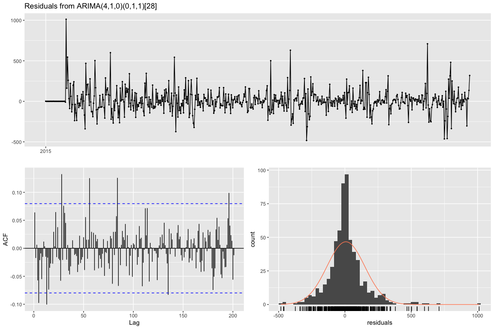
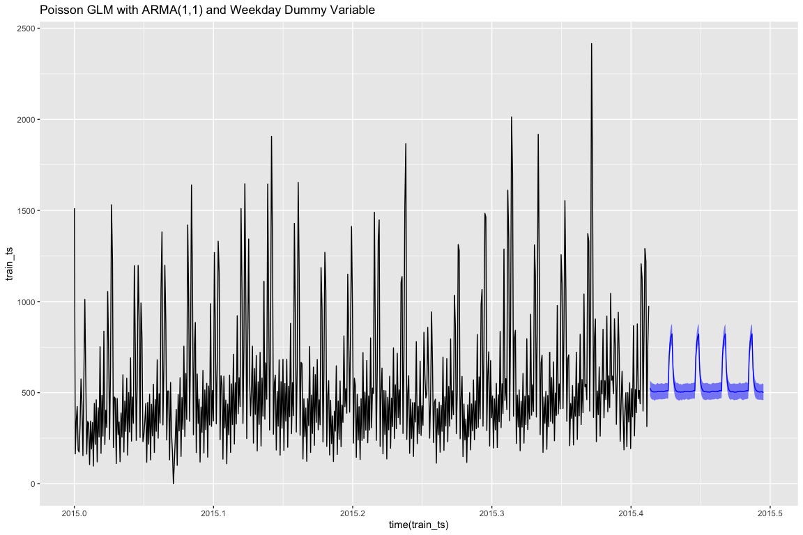
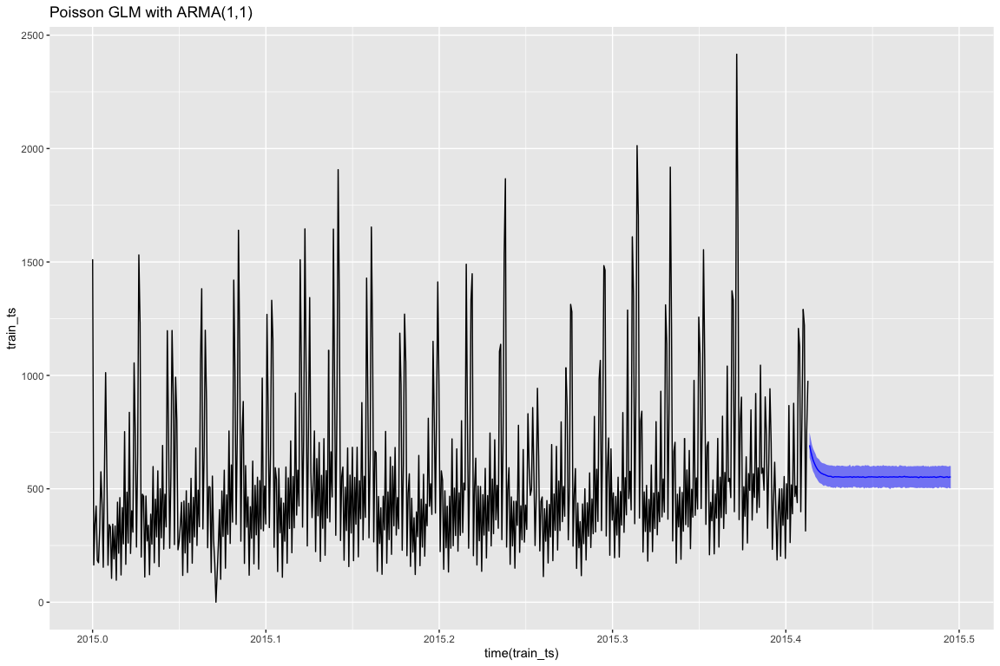
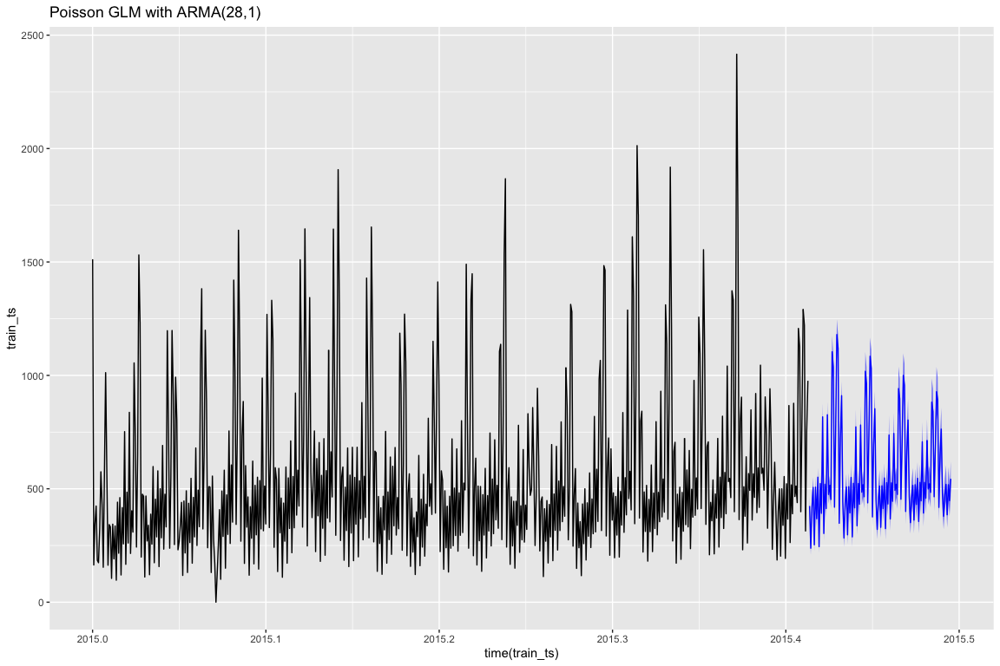

# SARIMA Models

```r
# Install required libraries if necessary.
library("forecast")
library("lubridate")
library("gridExtra")
library("tidyverse")
library("caret")
library("tscount")
```


```r
# Input data
uber_6h <- read_csv('../../data/uber_pickups_lower_manhattan_wide_6h.csv') # Point this to the directory and file

uber_train <- uber_6h %>% filter(Pickup_date < ymd_hms("2015-06-01 00:00:00")) # This gives us a training set for all 8 locations
uber_test <- uber_6h %>% filter(Pickup_date >= ymd_hms("2015-06-01 00:00:00"))

# For the Poisson models
uber_train <- uber_train %>% mutate(season=weekdays(Pickup_date, abbreviate=TRUE))
uber_test <- uber_test %>% mutate(season=weekdays(Pickup_date, abbreviate=TRUE))
```


```r
# This block selects only east village data and splits it into train/test sets
full_ts <- msts(uber_6h$East_Village,
                    start=decimal_date(ymd_hms("2015-01-01 00:00:00")),
                    seasonal.periods=c(4, 1461))

train_ts <- msts(uber_train$East_Village,
                    start=decimal_date(ymd_hms("2015-01-01 00:00:00")),
                    seasonal.periods=c(4, 1461))

test_ts <- msts(uber_test$East_Village,
                    start=decimal_date(ymd_hms("2015-06-01 00:00:00")),
                    seasonal.periods=c(4, 1461))


# Helpful commands for later
y_test <- as.numeric(test_ts)
test_size <- length(y_test)
train_diff <- train_ts %>% diff()
```


```r
p1 <- train_diff  %>% ggAcf() + ggtitle("ACF of Differenced Uber Pickups")
p2 <- train_diff %>% ggPacf() + ggtitle("PACF of Differenced Uber Pickups")
grid.arrange(p1, p2, nrow=2, ncol=1)
```

<!-- -->


```r
# ACF of differenced data
train_diff %>% Acf(plot=FALSE, lag.max=30)
```

```
## 
## Autocorrelations of series '.', by lag
## 
##      0      1      2      3      4      5      6      7      8      9 
##  1.000 -0.387 -0.166 -0.196  0.601 -0.306 -0.037 -0.123  0.275 -0.153 
##     10     11     12     13     14     15     16     17     18     19 
##  0.014 -0.129  0.232 -0.133  0.030 -0.124  0.218 -0.128  0.020 -0.148 
##     20     21     22     23     24     25     26     27     28     29 
##  0.259 -0.117 -0.026 -0.291  0.559 -0.179 -0.144 -0.346  0.857 -0.338 
##     30 
## -0.144
```


```r
# PACF of differenced data
train_diff %>% Pacf(plot=FALSE, lag.max=30)
```

```
## 
## Partial autocorrelations of series '.', by lag
## 
##      1      2      3      4      5      6      7      8      9     10 
## -0.387 -0.371 -0.583  0.239 -0.036  0.086  0.014 -0.164 -0.060 -0.091 
##     11     12     13     14     15     16     17     18     19     20 
## -0.160  0.082 -0.060  0.006 -0.067 -0.043 -0.019 -0.070 -0.189  0.010 
##     21     22     23     24     25     26     27     28     29     30 
## -0.031 -0.065 -0.493  0.187  0.061 -0.105 -0.440  0.441  0.115  0.135
```


There is __clear seasonality__. Each date is 1 " uber shift", so 28 "uber shifts" would be 7 days of pickups.

In the __ACF plot there is a spike at lag 4__, and another lower spike at lag 8, lag 12, etc (an exponential decay). In addition, there are __large spikes at lag 28*n__. This indicates an __AR(4) component and seasonal component at lag 28__. The PACF spikes and __cuts off after lag 3__, and spikes again at lag 28. This further suggests an AR(4) or AR(3) model.


```r
gglagplot(train_diff, set.lags= c(4, 8, 12, 28, 56, 84), do.lines=FALSE, colour=FALSE) + ggtitle("Autocorrelation for different lags: Train Diff")
```

<!-- -->

Above we checked the lags that seemed positively correlated. Sure enough, they are highly correlated.


Next we difference the series 28 times for the D=1 seasonal difference. Here we can see __what the order of the seasonal component__ would be.


```r
train_sdiff <- train_ts %>% diff(lag=28)

p1 <- train_sdiff %>% ggAcf() + ggtitle("ACF of Diff(28) data")
p2 <- train_sdiff %>% ggPacf() + ggtitle("PACF of Diff(28) data")
grid.arrange(p1, p2, nrow=2, ncol=1)
```

<!-- -->


```r
# ACF of seasonal component
train_ts %>% diff(lag=28) %>% Acf(plot=FALSE, lag.max=30) 
```

```
## 
## Autocorrelations of series '.', by lag
## 
##      0      1      2      3      4      5      6      7      8      9 
##  1.000  0.388  0.187  0.201  0.309  0.155  0.098  0.106  0.098  0.090 
##     10     11     12     13     14     15     16     17     18     19 
##  0.068  0.043  0.033  0.015  0.034  0.012  0.012 -0.011 -0.001 -0.006 
##     20     21     22     23     24     25     26     27     28     29 
##  0.016 -0.006  0.009 -0.046 -0.121 -0.106 -0.075 -0.197 -0.438 -0.199 
##     30 
## -0.046
```


```r
# PACF of seasonal component
train_ts %>% diff(lag=28) %>% Pacf(plot=FALSE, lag.max=30) 
```

```
## 
## Partial autocorrelations of series '.', by lag
## 
##      1      2      3      4      5      6      7      8      9     10 
##  0.388  0.043  0.136  0.222 -0.055  0.013  0.018 -0.021  0.043  0.003 
##     11     12     13     14     15     16     17     18     19     20 
## -0.018  0.000 -0.030  0.023 -0.013  0.005 -0.020 -0.005 -0.005  0.026 
##     21     22     23     24     25     26     27     28     29     30 
## -0.013  0.023 -0.069 -0.121 -0.029 -0.025 -0.158 -0.347  0.116  0.099
```

The ACF and PACF of the seasonal differenced data look very similar. There is a __spike at lag 1__ and at lag 28 (ACF) and lag 29 (PACF). Besides these two spikes, the rest of the values tend to stick around zero. __This is indicative of an SMA(1) seasonal component__. There doesn't appear to be any SAR(P) component. Since we took one seasonal difference, then D=1.

We will now __make an ARIMA model based on the ACF and PACF plots of the diff(1) and diff(28)__ version of our original data. 


## SARIMA Models


The first model is based on the model presented in the time series analysis book mixed with the seasonality that we observe in the Uber dataset. This is a model that is used in economics and was used to predict airline passengers in the book. 


```r
# Intuitive model based on the plots
m1 <- Arima(train_ts, 
      order=c(1, 1, 0), 
      seasonal=list(order=c(0,1,1), period=28))

yhat <- m1 %>% forecast(h=test_size)

# Plot the predictions
yhat %>% autoplot()
```

<!-- -->

```r
# Print out summary of the coefficients
m1 %>% summary()
```

```
## Series: train_ts 
## ARIMA(1,1,0)(0,1,1)[28] 
## 
## Coefficients:
##           ar1     sma1
##       -0.3765  -0.9039
## s.e.   0.0426   0.0498
## 
## sigma^2 estimated as 26438:  log likelihood=-3766.04
## AIC=7538.09   AICc=7538.13   BIC=7551.15
## 
## Training set error measures:
##                    ME   RMSE      MAE MPE MAPE MASE        ACF1
## Training set 7.162789 158.37 98.86515 Inf  Inf  NaN -0.06150298
```

The pattern looks like it was captured in the predictive mean of the forecast, but the prediction intervals get really wide for forecasts beyond about 2 weeks. At this point, __the prediction interval captures negative values__. 

Next we use p=4 since this is what was uncovered in the ACF and PACF plots of the differenced time series.


```r
m2 <- Arima(train_ts, 
      order=c(4, 1, 0), 
      seasonal=list(order=c(0,1,1), period=28))

yhat2 <- m2 %>% forecast(h=test_size)
yhat2 %>% autoplot()
```

<!-- -->

This second model dips below zero in the prediction interval after the first week. The AIC and BIC of this model are also lower than that of the first economic model.

The last model is one that is chosen by `auto.arima` on the basis of AIC. However, the function needs a time series with frequency defined and I struggled to understand the frequency parameter. I made a guess that it would be the number of days in a year (1 season) divided by the value of the season present in my data.


```r
# Auto arima with forced seasonality
train_seasonal <- ts(uber_train$East_Village, frequency=365.4/28)
m_auto <- auto.arima(train_seasonal, D=1) %>% forecast(h=test_size) %>% autoplot()
m_auto 
```

<!-- -->

This model does worse than the first two. 


```r
# Comparison of model results
p1 <- ggplot()+
  geom_point(mapping=aes(x=y_test, y=yhat$mean))+
  xlim(min(y_test), max(y_test))+
  ylim(min(y_test), max(y_test))+
  ggtitle("Actual vs. Predicted (m1)")

p2 <- ggplot()+
  geom_point(mapping=aes(x=y_test, y=yhat2$mean))+
  xlim(min(y_test), max(y_test))+
  ylim(min(y_test), max(y_test))+
  ggtitle("Actual vs. Predicted (m2)")

grid.arrange(p1, p2, nrow=1, ncol=2)
```

<!-- -->

This plot shows how close the predicted and actual test sets are.

### Ljung-Box Tests


```r
checkresiduals(m1)
```

<!-- -->

```
## 
## 	Ljung-Box test
## 
## data:  Residuals from ARIMA(1,1,0)(0,1,1)[28]
## Q* = 220.1, df = 119, p-value = 5.058e-08
## 
## Model df: 2.   Total lags used: 121
```


```r
checkresiduals(m2)
```

<!-- -->

```
## 
## 	Ljung-Box test
## 
## data:  Residuals from ARIMA(4,1,0)(0,1,1)[28]
## Q* = 127.34, df = 116, p-value = 0.2222
## 
## Model df: 5.   Total lags used: 121
```


`m1` was pretty good but didn't pass the Ljung-Box test of significance. However `m2` did. And this also assumes normally-distributed errors which isn't exactly true with our data since it's Poisson distributed. 


## Poisson Models

These include William's model and other models with varying orders of $p$ and $q$, which are specified using `past_obs` (p) and `past_mean` (q).


```r
# One-hot encoding function for weekly seasonal variable
dmy <- dummyVars(~season, data = uber_train)
trainCovariates <- data.frame(predict(dmy ,newdata=data.frame(season=uber_train$season)))
testCovariates <- data.frame(predict(dmy ,newdata=data.frame(season=uber_test$season)))
```


```r
# Hakeems run: trying a seasonal dummy variable
m3 <- tsglm(train_ts, model=list(past_obs=1, past_mean=1), distr="poisson", xreg=trainCovariates)

yhat_m3 <- predict(m3, n.ahead=test_size, newxreg=testCovariates)

predint_m3 <- data.frame(yhat_m3$interval)

ggplot()+
  geom_line(mapping=aes(x=time(train_ts), y=train_ts))+
  geom_ribbon(mapping=aes(x=time(test_ts), ymin=predint_m3$lower, ymax = predint_m3$upper), fill="blue", alpha=0.5)+
  geom_line(mapping=aes(x=time(test_ts), y=yhat_m3$median), color="blue")+
  ggtitle("Poisson GLM with ARMA(1,1) and Weekday Dummy Variable")
```

<!-- -->


```r
# Williams run: initial run with tsglm

m4 <- tsglm(train_ts, model=list(past_obs=1, past_mean=1), distr="poisson")

yhat_m4 <- predict(m4, n.ahead=test_size)

predint_m4 <- data.frame(yhat_m4$interval)

ggplot()+
  geom_line(mapping=aes(x=time(train_ts), y=train_ts))+
  geom_ribbon(mapping=aes(x=time(test_ts), ymin=predint_m4$lower, ymax = predint_m4$upper), fill="blue", alpha=0.5)+
  geom_line(mapping=aes(x=time(test_ts), y=yhat_m4$median), color="blue")+
  ggtitle("Poisson GLM with ARMA(1,1)")
```

<!-- -->


```r
m5 <- tsglm(train_ts, model=list(past_obs=28, past_mean=1), distr="poisson")

yhat_m5 <- predict(m5, n.ahead=test_size)

predint_m5 <- data.frame(yhat_m5$interval)

ggplot()+
  geom_line(mapping=aes(x=time(train_ts), y=train_ts))+
  geom_ribbon(mapping=aes(x=time(test_ts), ymin=predint_m5$lower, ymax = predint_m5$upper), fill="blue", alpha=0.5)+
  geom_line(mapping=aes(x=time(test_ts), y=yhat_m5$median), color="blue")+
  ggtitle("Poisson GLM with ARMA(28,1)")
```

<!-- -->
